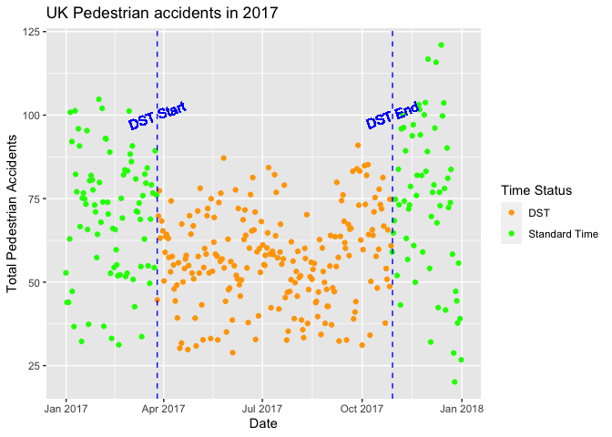

EDA_Type_of_accidents
================
2023-04-18

- Does Daylight Saving Time have an affect on the types of accidents
  that occur during the year (fatal, serious, slight, pedestrian)?

``` r
df<- read_csv("./data/dlst_red.csv", show_col_types = FALSE)
head(df)
```

    ## # A tibble: 6 × 21
    ##   mlong  mlat date       sunrise6_time       sunset6_time         year   doy
    ##   <dbl> <dbl> <date>     <dttm>              <dttm>              <dbl> <dbl>
    ## 1 -7.75  56.8 2012-01-01 1960-01-01 08:19:00 1960-01-01 16:49:00  2012     1
    ## 2 -7.75  56.8 2012-01-02 1960-01-01 08:18:00 1960-01-01 16:50:00  2012     2
    ## 3 -7.75  56.8 2012-01-03 1960-01-01 08:18:00 1960-01-01 16:52:00  2012     3
    ## 4 -7.75  56.8 2012-01-04 1960-01-01 08:18:00 1960-01-01 16:53:00  2012     4
    ## 5 -7.75  56.8 2012-01-05 1960-01-01 08:18:00 1960-01-01 16:54:00  2012     5
    ## 6 -7.75  56.8 2012-01-06 1960-01-01 08:17:00 1960-01-01 16:55:00  2012     6
    ## # … with 14 more variables: dow <dbl>, longlat <dbl>, darkh <dbl>,
    ## #   all_accid <dbl>, u25_accid <dbl>, o25u45_accid <dbl>, o45u65_accid <dbl>,
    ## #   o65_accid <dbl>, ped_accid <dbl>, ped_u45_accid <dbl>, ped_o45_accid <dbl>,
    ## #   fat_accid <dbl>, ser_accid <dbl>, slight_accid <dbl>

``` r
monthly_df<-df %>% mutate(date_month=format(date, "%Y-%m"))%>%
  group_by(date_month)%>%summarise(total_all_accid=sum(all_accid))

series<-monthly_df$total_all_accid

temp<-ts(series, start=c(2012,01), end=c(2017, 12), frequency=12)

ts.plot(temp, xlab="Year", ylab="total all_types accidents in UK")
title(main="Yearly Total All Accidents in UK")
```

<!-- -->

``` r
decompose_all<-decompose(temp)
plot(decompose_all$seasonal)+title("Seasonal component")
```

<!-- -->

    ## integer(0)

``` r
dst_start <- ymd("2017-03-26") # Change to your region's DST start date
dst_end <- ymd("2017-10-29") # Change to your region's DST end date

fat_accident_2017<-df %>% filter(substr(date, 1, 4)=="2017") %>%
  mutate(is_dst = ifelse(date >= dst_start & date < dst_end, "DST", "Standard Time")) %>%
  group_by(date, is_dst) %>%
  summarise(total_fat_accident=sum(fat_accid))
```

    ## `summarise()` has grouped output by 'date'. You can override using the
    ## `.groups` argument.

``` r
fat_accident_2017 %>%
  ggplot(aes(x = date, y = total_fat_accident, color = is_dst)) +
  geom_point(position = "jitter") +
  geom_vline(xintercept = as.numeric(dst_start), color="Blue", linetype="dashed") +
  geom_vline(xintercept = as.numeric(dst_end), color="Blue", linetype="dashed") +
  geom_text(aes(x = dst_start, y = 100, label = "DST Start"), angle=20, color="Blue") +
  geom_text(aes(x = dst_end, y = 100, label = "DST End"), angle=20, color="Blue") +
  labs(title = "UK Fatal accidents in 2017",
       x = "Date",
       y = "Total Fatal Accidents",
       color = "Time Status") +
  scale_color_manual(values = c("DST" = "orange", "Standard Time" = "green"))
```

<!-- -->

``` r
# Improved boxplot
fat_accident_2017 %>%
  ggplot(aes(x = is_dst, y = total_fat_accident, fill = is_dst)) +
  geom_boxplot() +
  labs(title = "UK Fatal accidents in 2017",
       x = "Time Status",
       y = "Total Fatal Accidents") +
  scale_fill_manual(values = c("DST" = "orange", "Standard Time" = "green")) +
  theme_minimal()
```

<!-- -->

``` r
ser_accident_2017<-df %>% filter(substr(date, 1, 4)=="2017") %>%
  mutate(is_dst = ifelse(date >= dst_start & date < dst_end, "DST", "Standard Time")) %>%
  group_by(date, is_dst) %>%
  summarise(total_ser_accident=sum(ser_accid))
```

    ## `summarise()` has grouped output by 'date'. You can override using the
    ## `.groups` argument.

``` r
ser_accident_2017 %>%
  ggplot(aes(x = date, y = total_ser_accident, color = is_dst)) +
  geom_point(position = "jitter") +
  geom_vline(xintercept = as.numeric(dst_start), color="Blue", linetype="dashed") +
  geom_vline(xintercept = as.numeric(dst_end), color="Blue", linetype="dashed") +
  geom_text(aes(x = dst_start, y = 100, label = "DST Start"), angle=20, color="Blue") +
  geom_text(aes(x = dst_end, y = 100, label = "DST End"), angle=20, color="Blue") +
  labs(title = "UK Serious accidents in 2017",
       x = "Date",
       y = "Total Serious Accidents",
       color = "Time Status") +
  scale_color_manual(values = c("DST" = "orange", "Standard Time" = "green"))
```

<!-- -->

``` r
# Improved boxplot
ser_accident_2017 %>%
  ggplot(aes(x = is_dst, y = total_ser_accident, fill = is_dst)) +
  geom_boxplot() +
  labs(title = "UK Serious accidents in 2017",
       x = "Time Status",
       y = "Total Serious Accidents") +
  scale_fill_manual(values = c("DST" = "orange", "Standard Time" = "green")) +
  theme_minimal()
```

<!-- -->

``` r
slight_accident_2017<-df %>% filter(substr(date, 1, 4)=="2017") %>%
  mutate(is_dst = ifelse(date >= dst_start & date < dst_end, "DST", "Standard Time")) %>%
  group_by(date, is_dst) %>%
  summarise(total_slight_accident=sum(slight_accid))
```

    ## `summarise()` has grouped output by 'date'. You can override using the
    ## `.groups` argument.

``` r
slight_accident_2017 %>%
  ggplot(aes(x = date, y = total_slight_accident, color = is_dst)) +
  geom_point(position = "jitter") +
  geom_vline(xintercept = as.numeric(dst_start), color="Blue", linetype="dashed") +
  geom_vline(xintercept = as.numeric(dst_end), color="Blue", linetype="dashed") +
  geom_text(aes(x = dst_start, y = 400, label = "DST Start"), angle=20, color="Blue") +
  geom_text(aes(x = dst_end, y = 400, label = "DST End"), angle=20, color="Blue") +
  labs(title = "UK Slight accidents in 2017",
       x = "Date",
       y = "Total Slight Accidents",
       color = "Time Status") +
  scale_color_manual(values = c("DST" = "orange", "Standard Time" = "green"))
```

<!-- -->

``` r
# Improved boxplot
slight_accident_2017 %>%
  ggplot(aes(x = is_dst, y = total_slight_accident, fill = is_dst)) +
  geom_boxplot() +
  labs(title = "UK Slight accidents in 2017",
       x = "Time Status",
       y = "Total Slight Accidents") +
  scale_fill_manual(values = c("DST" = "orange", "Standard Time" = "green")) +
  theme_minimal()
```

<!-- -->

``` r
ped_accident_2017<-df %>% filter(substr(date, 1, 4)=="2017") %>%
  mutate(is_dst = ifelse(date >= dst_start & date < dst_end, "DST", "Standard Time")) %>%
  group_by(date, is_dst) %>%
  summarise(total_ped_accident=sum(ped_accid))
```

    ## `summarise()` has grouped output by 'date'. You can override using the
    ## `.groups` argument.

``` r
ped_accident_2017 %>%
  ggplot(aes(x = date, y = total_ped_accident, color = is_dst)) +
  geom_point(position = "jitter") +
  geom_vline(xintercept = as.numeric(dst_start), color="Blue", linetype="dashed") +
  geom_vline(xintercept = as.numeric(dst_end), color="Blue", linetype="dashed") +
  geom_text(aes(x = dst_start, y = 100, label = "DST Start"), angle=20, color="Blue") +
  geom_text(aes(x = dst_end, y = 100, label = "DST End"), angle=20, color="Blue") +
  labs(title = "UK Pedestrian accidents in 2017",
       x = "Date",
       y = "Total Pedestrian Accidents",
       color = "Time Status") +
  scale_color_manual(values = c("DST" = "orange", "Standard Time" = "green"))
```

<!-- -->

``` r
# Improved boxplot
ped_accident_2017 %>%
  ggplot(aes(x = is_dst, y = total_ped_accident, fill = is_dst)) +
  geom_boxplot() +
  labs(title = "UK Pedestrian accidents in 2017",
       x = "Time Status",
       y = "Total Pedestrian Accidents") +
  scale_fill_manual(values = c("DST" = "orange", "Standard Time" = "green")) +
  theme_minimal()
```

<!-- -->
