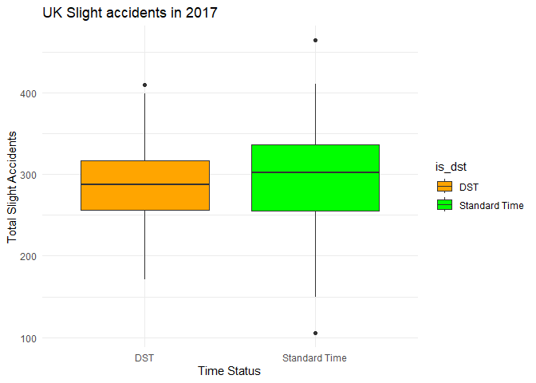

Daylight Saving Time and Road Safety in the United Kingdom
================
Team tidyverse: Katie Hansen, Yuqing Yang, Hongyi Yu, Jeffrey Emmons
2023-05-01

# Abstract

This study investigates the relationship between Daylight Saving Time
(DST) and road safety in the United Kingdom from 2012 to 2017. Using
data from the Harvard Review of Economics and Statistics, our analysis
aims to show the effects of DST on road accidents in multiple aspects.
It also compares trends in road safety for different regions in the UK
by using spatial analysis. Our results show a statistically significant
change in road accidents when time shifts from regular time to DST, and
vice versa. The results of this study could potentially be utilized to
increase safety precautions and awareness around annual time shifting as
well as be utilized as scientific resources in the debate over whether
or not to continue with the Daylight Saving Time practice.

# Introduction

Daylight saving has been a controversial issue for many countries around
the world. In the United Kingdom, the use of Daylight Savings Time
initially originated with the Summer Time Act of 1916, being established
during World War I for fuel conservation (The Economic Times). While the
practice theoretically conserves energy and helps people enjoy more
sunlight in the evening during warmer months, the one-hour change is not
trivial for humans’ physical and mental health in the long term. One
study suggests that people sleep an average of 40 minutes less on the
day after “Spring Forward” compared to other days of the year (Barnes
2009). Disrupted sleep not only causes fatigue and less focus but also
exacerbates health problems such as depression, seasonal disorders, and
even heart attacks. Such effects also relate to road safety and vehicle
collisions. Although longer daylight hours give drivers better
visibility to some extent, we raise a hypothesis that the number of car
accidents may be affected by annual changing time due to Daylight Saving
Time.

This report will discuss the effects of Daylight Saving Time on road
safety in the UK between 2012 to 2017. We will look at how factors such
as the time of the year, the geographic region, and the age cohort of
the drivers might affect the number of accidents that occur during the
weeks before and after Daylight Saving Time. We will also analyze the
impact of the long-term consequences of Daylight Saving time on road
safety each year and its influence on different types of accidents,
including fatal, serious, slight, and pedestrian accidents. We hope that
our analysis can contribute to people’s understanding of Daylight Saving
and provide some inspiration on whether to keep this convention.

# Data and Methods

## Data Source

Replication Data, for “Spring Forward, Don’t Fall Back: The Effect of
Daylight Saving Time on Road Safety”, Bünnings, C., & Schiele, V.
(2021), Review of Economics and Statistics 103(1), 165-176, retrieved
from [Harvard Review of Economics and Statistics
Dataverse](https://doi.org/10.7910/DVN/UVUXDR)

## Data Description

The dataset contains detailed information about the time, location, and
driver demographics of road accidents from 1996 to 2017. For our
investigation, we will focus on the following variables from the
dataset: mlong, mlat, date, hour, all_accid, u25_accid, o25u45_accid,
o45u65_accid, o65_accid, year, doy (day of the year), dow (day of the
week). mlong and mlat represent the longitude and latitude of each
center of the corresponding region where the accident occurred. The
number of accidents are categorized by the age of the driver (under 25,
26-45, 46-65, and over 65) and various level of accident severity
(fatal, serious, slight)

## Method

- Preprocessing - The dataset was divided into two subsets:
  - Primary dataset: Rows were collapsed from hourly to daily value, and
    the data was limited to the year from 2012 to 2017.
  - Hourly dataset: Rows maintained original values in hourly units, and
    data was kept only in the year 2017.
- Exploratory Data Analysis:
  - Time series analysis of yearly accident counts change from 2012 to
    2017
- Daylight saving time (DST) effects on different aspects:
  - Impact of DST on different types of accidents(fatal, serious,
    slight, driver age) in the year 2017
  - Impact of DST on accident counts in different regions by year.
- Effect of DST change on accident counts:
  - Analysis of accident counts during the two weeks before and after
    DST starts or ends by year
  - Analysis of accident counts per hour during the two weeks before and
    after DST starts or ends in the year 2017.
- T-test: conducting T-test to compare the mean accident counts before
  and after DST starts or ends
- Spatial analysis: investigating various effect of DST change on
  different regions in the UK

# Results

## Effect of Daylight Saving Time on Road Accidents by Year

<!-- -->

Plotting the trend of accidents of all types of accidents over a
five-year period reveals that the trends in the number of accidents are
about the same every year. The average number of accidents for every day
of the year remains around 400. Every year, there is a very slight
increase in the number of accidents at the end of the year. An analysis
of the direct effect of the change to and from Daylight Saving Time
requires plotting a more specific time frame, two weeks in our case.

<!-- -->

By plotting the time series of total accident counts from the year 2012
to 2017 in the frequency of 12 (monthly data), generally we could find
the time series has non-constant variance through the year, showing a
downward trending from 2012 to the end of 2017. In the plot, there is a
remarkable fluctuated pattern during each year, in which, for example,
during the year 2012, the total number of all-type road accidents showed
an increase from the start of year and peaked in late October, and then
dropped down to the bottom at the end of December. Based on the pattern,
we can draw a hypothesis that the time series of total road accident
counts has seasonality.

<!-- -->

    ## integer(0)

To verify our finding, we decomposed the time series into its seasonal
component. According to the plot, we can clearly see that non-constant
seasonality exists in our data. Road accidents can be related to
seasonality due to many factors such as daylight hours, weather, and
etc. For the daylight hours, except for actual daylight hours changed
between warmer months to colder months, annually twice the time shifting
may cause people to perceive more daylight in warmer months especially
in the evenings. The time shifting can raise healthy risks. [According
to cell.com, a 2020 study found that the switch raises the risk of fatal
traffic accidents by
6%.](https://www.cell.com/current-biology/fulltext/S0960-9822(19)31678-1)
Therefore, we are going to investigate more in detail on the
relationship between time shifting due to DST and the frequency at which
road accidents occur in the United Kingdom.

## Effects of DST on Various Types of Accident (severity and age group)

### Effects of DST on road accidents in levels of severity

In our dataset, there are various types of accidents such as fatal,
serious, slight accidents and accidents involving pedestrians. By
plotting scatter plots for each type of accidents in the year 2017,
colored by time status, as well as their corresponding boxplots, except
for the plot of fatal accident counts versus time keeps consistent
throughout the year, we can clearly observe the accident counts change
between DST interval and standard time interval for all other types (see
appendix). Let’s concentrate on two dates when DST begins and ends in
2017, marked in a vertical dashed blue line. By doing so, we could
observe significant fluctuations in the accident counts around these two
dates. Here is the plot of accidents involving pedestrian:

### Effects of DST by age group

In general, drivers under 25 and over 65 were involved in less accidents
than drivers aged 25 to 65, but the change in number of accidents
depending on Daylight Saving Time was minimal. The red line indicating
the mean number of accidents per day shows a very slight peak for the
46-65 and over 65 age groups in the middle of the summer months. Like
the general trends throughout several years, the effect of DST on
accidents by age group can be better analyzed by looking at a smaller
time frame before and after the time change.

<!-- -->

## Effects of DST on Different Regions of the UK

As our dataset includes the longitude and latitude of the accidents that
occur, we decided to plot the observations of accidents on the map. We
found that our data focus on the region from 49.75 to 60.75 latitude and
from -7.75 to 1.75 longitude, which is mainly the territory of the
United Kingdom. Therefore, we downloaded the UK region and district
shapefile from the UK Data Service and plotted the map with the
coordinate reference system. Through joining the shapefile and the DST
dataset, we could identify the regions of each accident. The
observations in Northern Ireland and London are too few to get the
result. Therefore, we will mainly focus on the regions of Scotland,
North East, North West, Yorkshire and the Humber, West Midlands, East
Midlands, East of England, South East, and South West.

    ##  [1] "North East (England)"     "North West (England)"    
    ##  [3] "Yorkshire and The Humber" "East Midlands (England)" 
    ##  [5] "West Midlands (England)"  "East of England"         
    ##  [7] "London"                   "South East (England)"    
    ##  [9] "South West (England)"     "Wales"                   
    ## [11] "Scotland"                 "Northern Ireland"

Since Daylight Saving Time in the UK is different each year, we chose
one week after the two periods of DST change for each year and produced
the map with the number of accidents during this time from 2012 to 2017.
There is a geographical pattern of the regions with more and fewer
accidents over the years. Scotland, South East, South West, and East of
England have a generally high accidental rate during DST each year.
North East, North West, and Yorkshire and the Humber have relatively
fewer accidents during DST. Generally, Northern England (the Northern
part of the UK except for Scotland) has safer road traffic during DST
than Southern England.

To better see the trend of the number of accidents during DST in
different regions from 2012 to 2017, we faceted the observations by
regions and found that the number of accidents are mostly stable for
each region over time.

Although regions like Scotland have more accidents during DST, we
suspected that it has a higher accident rate than other regions for the
whole year, which may not relate directly to Daylight Saving Time.
Therefore, we plotted the number of accidents for different regions in
2017 through the months. It shows that Scotland indeed had more
accidents than other regions through 2017, while North East had the
fewest accidents for the year.

Therefore, we decided to use a function to measure the ratio of the
number of accidents during DST compared to the average number of
accidents during the year. We produce a formula to divide the number of
accidents per day during DST by the average number for the year and
multiplied by 100. For the regions where Daylight Saving does not affect
road safety, the ratio should be 100. A ratio greater than 100 means
that there is a negative effect of Daylight Saving on road safety. The
maps show that the effects of DST on different regions vary over the
years. In 2017, Scotland was mostly affected by Daylight Saving, and the
number of accidents increased dramatically during DST. However, in 2013,
Scotland had fewer accidents during DST. In 2016, the effects of
Daylight Saving for all regions were not obvious compared to other
years. Generally, the impact of DST on the Southern part of England was
relatively smaller than the North.

## Immediate Effects of DST Change

In order to examine the immediate effects of a change from Standard Time
to Daylight Saving Time, or vice versa, we compared the two weeks
immediately before a change with the two weeks immediately after. A new
categorical variable was created in order to indicate whether a certain
observation fell into any of these two week periods - and if so, which
one - creating four subgroups of this subset of the data. Simple
scatterplots of these four subgroups showed that the number of accidents
appears to slightly decrease in the two weeks following a start in DST
compared to the two weeks before, while the number accidents appears to
increase in the two weeks following the end of DST compared to the two
weeks before.

When breaking down this data by age group and by year, this pattern
appears to be mostly maintained, though some years do seem to go against
this trend.

In order to further examine the magnitude of the difference, two
separate two sample t-tests were performed in order to compare the mean
number of accidents per day before and after each change. The mean
number of accidents per day in the two weeks before the start of
Daylight Saving Time was approximately 369, while the mean number of
accidents afterwards was approximately 349. The t-test yielded a p-value
of 0.03289. Though perhaps not quite as strong as we would like, this is
significant at $\alpha$ = 0.05. Furthermore, the 95% confidence interval
for the difference between the two means does not contain zero, thus we
can conclude that there is a decrease in accidents after the start of
DST compared to before.

    ## 
    ##  Welch Two Sample t-test
    ## 
    ## data:  bef_st_vals and aft_st_vals
    ## t = 1.0185, df = 171.88, p-value = 0.3099
    ## alternative hypothesis: true difference in means is not equal to 0
    ## 95 percent confidence interval:
    ##  -8.761267 27.440632
    ## sample estimates:
    ## mean of x mean of y 
    ##  347.7619  338.4222

For the end of Daylight Saving Time, the mean number of accidents per
day in the two weeks before was approximately 391, while the mean number
of accidents afterwards was approximately 420. The t-test yielded a
p-value of 0.007127, which would be significant at $\alpha$ = 0.05, and
is also stronger than the t-test for the start of DST. Furthermore, the
95% confidence interval for the difference between the two means does
not contain zero, thus we can conclude that there is an increase in
accidents after the end of DST compared to before.

    ## 
    ##  Welch Two Sample t-test
    ## 
    ## data:  bef_end_vals and aft_end_vals
    ## t = -1.6313, df = 171.68, p-value = 0.1047
    ## alternative hypothesis: true difference in means is not equal to 0
    ## 95 percent confidence interval:
    ##  -36.940887   3.510728
    ## sample estimates:
    ## mean of x mean of y 
    ##  394.4405  411.1556

We then wanted to investigate how these changes look based on the year
and geographical location. For each county in England, Wales, and
Scotland, we plotted the change in mean number of accidents from before
a time change to after. A map of these changes was made for both the
start and end of Daylight Saving Time for each year, for a total of 12
maps (see appendix). The result we found was that, in most years, many
counties saw a decrease in accidents due to the start of Daylight Saving
Time, while seeing an increase in accidents due to the end of Daylight
Saving Time. While there were instances in which this was not the case,
the overall trend was consistent with this pattern.

    ## Reading layer `EW1971_admcounties' from data source 
    ##   `C:\Users\bluel\OneDrive\Desktop\School Work\MA 415\project-tidyverse\data\EW1971_admcounties\EW1971_admcounties.shp' 
    ##   using driver `ESRI Shapefile'
    ## Simple feature collection with 59 features and 6 fields
    ## Geometry type: MULTIPOLYGON
    ## Dimension:     XY
    ## Bounding box:  xmin: 87019.07 ymin: 7067.26 xmax: 655838 ymax: 657543.5
    ## Projected CRS: OSGB36 / British National Grid

    ## Reading layer `S1951_scocounties' from data source 
    ##   `C:\Users\bluel\OneDrive\Desktop\School Work\MA 415\project-tidyverse\data\S1951_scocounties\S1951_scocounties.shp' 
    ##   using driver `ESRI Shapefile'
    ## Simple feature collection with 37 features and 6 fields
    ## Geometry type: MULTIPOLYGON
    ## Dimension:     XY
    ## Bounding box:  xmin: 7459 ymin: 530297 xmax: 469817 ymax: 1219574
    ## Projected CRS: OSGB36 / British National Grid

\## Hourly Effects Lastly, we wanted to investigate whether Daylight
Saving Time affects road safety differently at different times of day.
For this, we used the hourly data from 2017. We plotted the average
number of accidents for each hour of the day for each month. The most
noticeable finding here was that the months surrounding the start and
end of Daylight Saving Time followed a similar pattern to what we saw
when investigating the immediate effects of DST changes. The average
number of accidents seemed to decrease, especially in the morning, in
April compared to March. Meanwhile, accidents seemed to increase for
nearly all hours of the day in November compared to October.

This observation inspired us to return to investigating the immediate
effects of Daylight Saving Time, this time looking at hourly accident
rates. The same categorical variable from before was created for the
hourly dataset, and a plot of the average number of accidents for each
hour of the day was created for the four aforementioned subgroups. While
accident rates appeared to be the same amongst the four two-week periods
for most hours of the day, noticeable clustering could be observed at
hours 8 and 17, corresponding to 8-9 am and 5-6 pm, respectively. At
hour 8, we observed that accident rates were higher in the two weeks
before the start of DST and after the end, while accident rates were
lower in the two weeks after the start and before the end. This tells us
that less accidents tend to occur in the morning during Daylight Saving
Time. However, at hour 17, we observed that accident rates were higher
after both the start and end of DST, compared to before both the start
and end. This tells us that, in the evening, it is specifically a change
in time protocol that leads to more accidents, as opposed to which time
protocol is currently active.

<!-- -->

# Discussion

This study has given us insight into how Daylight Saving Time has
affected road safety in the past decade depending on age group, type of
accident, and the time of day accidents occurred. The most significant
effect we observed was the effect on all types of accidents in the two
weeks before and after each time change. The statistical analysis
indicates that there is a significant difference between accident rates
before and after the two time changes. This may be due to drive fatigue
because of lost sleep or an increase in driving during the night.
Practical uses of this observation may include heightening road safety
precautions such as signage and speed limit enforcement during these
times.

The regional analysis indicates that some parts of the UK, like Scotland
and Southern England are more affected by the time change. Even more
precautions can be taken in such places to further protect against
increased accidents during the time change.

For the year as a whole in all regions, there only seems to be a very
slight increase in accidents in the summer months for some age groups
and accident types. However, there are a number of other factors that
can affect accident rates such as weather conditions or individual
drivers’ behavior. Therefore, we cannot conclude absolutely that
Daylight Saving Time has an effect on accidents throughout the entire
year.

While it is clear that the time change has an immediate negative effect
on car safety, those who want to change the Daylight Saving Time policy
must weigh this with the benefits that inspired the creation of DST in
the first place.

Since this study is limited to data from the United Kingdom, it would
also be pertinent to perform the same study on data from the United
States or other countries. Since there is a time difference between the
US and the UK and Daylight Saving Time happens on different days,
Daylight Saving Time may affect the two locations differently.

Another drawback is that it can be difficult to discern what factors
besides DST directly affected the outcomes of the data. As previously
discussed, worse weather during the winter months, holiday seasons, or
decreased driver awareness may coincide with DST and also affect the
number of accidents. This study could be improved and supplemented by an
investigation of these factors on road safety, to determine if they do,
in fact, contribute to the changes in car accidents that we observe
throughout the year.

# References

“Daylight Savings Time to Continue in the UK despite Limited Benefits.”
The Economic Times, 26 Mar. 2023,
<https://economictimes.indiatimes.com/news/international/uk/daylight-savings-time-to-continue-in-the-uk-despite-limited-benefits/articleshow/99000607.cms>.  
Barnes, C. M., and D. T. Wagner. Changing to daylight saving time cuts
into sleep and increases workplace injuries. The Journal of applied
psychology, vol. 94 ed. 5, 1305–1317, 2019.
<http://doi.apa.org/getdoi.cfm?doi=10.1037/a0015320>.

# Appendix

