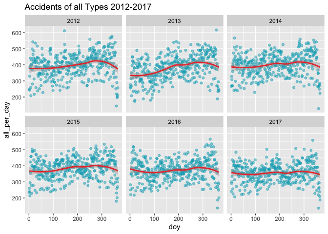
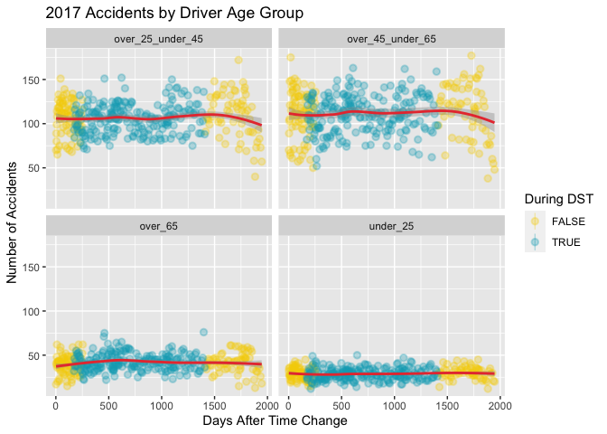

Age groups EDA
================

``` r
library(tidyverse)
```

    ## ── Attaching packages ─────────────────────────────────────── tidyverse 1.3.2 ──
    ## ✔ ggplot2 3.4.0      ✔ purrr   1.0.1 
    ## ✔ tibble  3.1.8      ✔ dplyr   1.0.10
    ## ✔ tidyr   1.3.0      ✔ stringr 1.5.0 
    ## ✔ readr   2.1.3      ✔ forcats 0.5.2 
    ## ── Conflicts ────────────────────────────────────────── tidyverse_conflicts() ──
    ## ✖ dplyr::filter() masks stats::filter()
    ## ✖ dplyr::lag()    masks stats::lag()

``` r
library(lubridate)
```

    ## 
    ## Attaching package: 'lubridate'
    ## 
    ## The following objects are masked from 'package:base':
    ## 
    ##     date, intersect, setdiff, union

``` r
df <- read.csv("data/dlst_red.csv")
(problems(df))
```

    ## # A tibble: 0 × 4
    ## # … with 4 variables: row <int>, col <int>, expected <chr>, actual <chr>

``` r
colnames(df)
```

    ##  [1] "mlong"         "mlat"          "date"          "sunrise6_time"
    ##  [5] "sunset6_time"  "year"          "doy"           "dow"          
    ##  [9] "longlat"       "darkh"         "all_accid"     "u25_accid"    
    ## [13] "o25u45_accid"  "o45u65_accid"  "o65_accid"     "ped_accid"    
    ## [17] "ped_u45_accid" "ped_o45_accid" "fat_accid"     "ser_accid"    
    ## [21] "slight_accid"

``` r
# (df %>% filter(date == ymd("2017-03-26")))
```

``` r
df_all_accid <- df %>% select(date, year, doy, dow, all_accid) %>%
  group_by(year, doy) %>%
  summarize(all_per_day = sum(all_accid)) 
```

    ## `summarise()` has grouped output by 'year'. You can override using the
    ## `.groups` argument.

``` r
(df_all_accid)
```

    ## # A tibble: 2,192 × 3
    ## # Groups:   year [6]
    ##     year   doy all_per_day
    ##    <int> <int>       <int>
    ##  1  2012     1         249
    ##  2  2012     2         243
    ##  3  2012     3         329
    ##  4  2012     4         382
    ##  5  2012     5         393
    ##  6  2012     6         442
    ##  7  2012     7         259
    ##  8  2012     8         208
    ##  9  2012     9         376
    ## 10  2012    10         403
    ## # … with 2,182 more rows

``` r
ggplot(df_all_accid, aes(x=doy, y=all_per_day)) +
  stat_summary(geom="point", fun.y=mean, alpha=0.5, color="#00abbf" ) +
  stat_smooth(col="#e83d3d") +
  facet_wrap(~ year) +
  ggtitle("Accidents of all Types 2012-2017")
```

    ## Warning: The `fun.y` argument of `stat_summary()` is deprecated as of ggplot2 3.3.0.
    ## ℹ Please use the `fun` argument instead.

    ## `geom_smooth()` using method = 'loess' and formula = 'y ~ x'

<!-- -->

By overlaying each year, we see that each year follows a similar trend:

Plotting the trend of accidents of all types of accidents over a
five-year period reveals that the changes in the number of accidents are
about the same every year. The average number of accidents for every day
of the year is concentrated around 400. Every year, there is a very
slight increase in the number of accidents at the end of the year. An
analysis of the direct of effect of the change to and from Daylight
Saving Time requires plotting a more specfic time frame, two weeks in
our case.

``` r
df %>% ggplot(aes(x=doy, y=all_accid)) + geom_line(aes(color=year), palette="RdYlBu", )
```

Since all years have a similar trend, we can pick a specific year and
investigate the effects of Daylight Saving Time throughout that specific
year in more detail. For example, the most recent year, 2017.

``` r
df_2017 %>% ggplot(aes(x=doy, y=slight_accid)) + geom_point(aes(col="orange")) + geom_smooth()
# df %>% ggplot(aes(x=doy, y=ser_accid)) + geom_line(aes(col="blue")) + geom_smooth()
# df %>% ggplot(aes(x=doy, y=fat_accid)) + geom_line(aes(col="green")) + geom_smooth()

#idea: do a doy shift so that the time change is at either end so the change is more noticeable
```

``` r
start_date <- ymd("2017-03-26") 
end_date <- ymd("2017-10-29")

df_2017 <- df %>% filter(year == 2017)

u25_accid_2017 <- df_2017 %>% 
  mutate(month = substr(date, 6, 7), 
         dst = (date >= start_date & date < end_date),
         dost = doy%%86 + (doy/86) * (86 + doy)) %>%
  group_by(month, dost, dst) %>% 
  summarize(under_25 = sum(u25_accid), over_25_under_45 = sum(o25u45_accid), 
            over_45_under_65 = sum(o45u65_accid), over_65 = sum(o65_accid))
```

    ## `summarise()` has grouped output by 'month', 'dost'. You can override using the
    ## `.groups` argument.

``` r
u25_accid_2017 <- u25_accid_2017 %>% 
  pivot_longer(cols = c(`under_25`, `over_25_under_45`, `over_45_under_65`, `over_65`),
               names_to = "driver_age_group",
               values_to = "num_accidents")

u25_accid_2017 %>% ggplot(aes(x = dost, y = num_accidents, color = dst)) +
  # geom_point(alpha = 0.5) +
  labs(title = "2017 Accidents by Driver Age Group",
       x = "Days After Time Change",
       y = "Number of Accidents",
       color = "During DST") +
  stat_summary(fun.y=mean, alpha = 0.3) +
  stat_smooth(col="#e83d3d") + 
  facet_wrap(~ driver_age_group) +
  scale_color_manual(values=c("#f4d000", "#00abbf")) 
```

    ## `geom_smooth()` using method = 'loess' and formula = 'y ~ x'

    ## Warning: Removed 365 rows containing missing values (`geom_segment()`).
    ## Removed 365 rows containing missing values (`geom_segment()`).
    ## Removed 365 rows containing missing values (`geom_segment()`).
    ## Removed 365 rows containing missing values (`geom_segment()`).

<!-- -->
