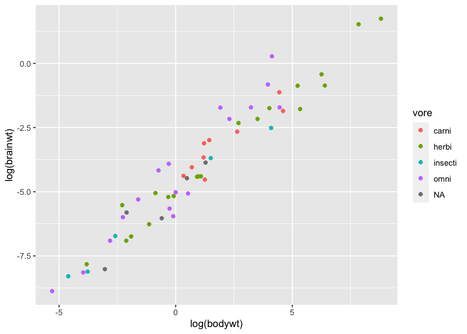
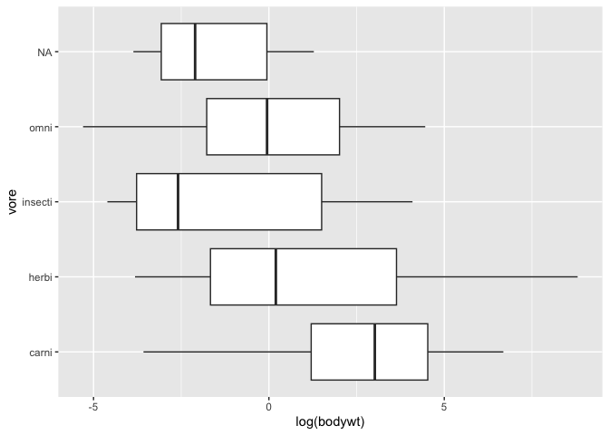
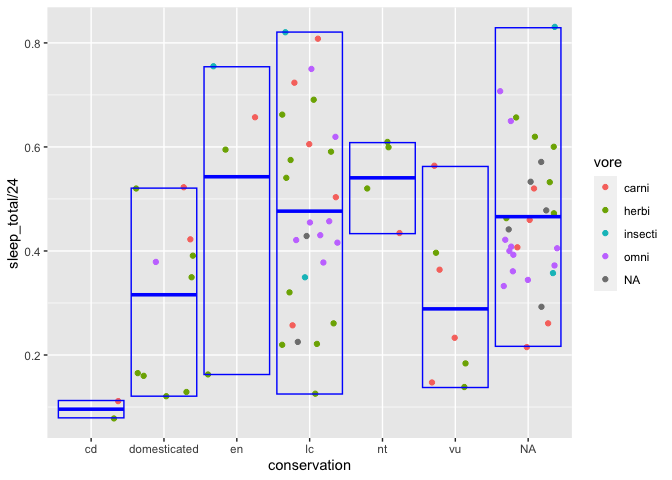
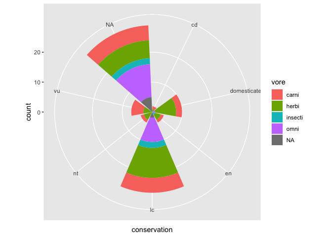

MA \[46\]15 Homework 1
================
Hongyi Yu

In this homework I’m analyzing the `msleep` dataset from package
`ggplot2`. I start by loading the packages:

``` r
library(tidyverse)
```

    ## ── Attaching packages ─────────────────────────────────────── tidyverse 1.3.2 ──
    ## ✔ ggplot2 3.4.0      ✔ purrr   1.0.1 
    ## ✔ tibble  3.1.8      ✔ dplyr   1.0.10
    ## ✔ tidyr   1.2.1      ✔ stringr 1.5.0 
    ## ✔ readr   2.1.3      ✔ forcats 0.5.2 
    ## ── Conflicts ────────────────────────────────────────── tidyverse_conflicts() ──
    ## ✖ dplyr::filter() masks stats::filter()
    ## ✖ dplyr::lag()    masks stats::lag()

``` r
msleep
```

    ## # A tibble: 83 × 11
    ##    name         genus vore  order conse…¹ sleep…² sleep…³ sleep…⁴ awake  brainwt
    ##    <chr>        <chr> <chr> <chr> <chr>     <dbl>   <dbl>   <dbl> <dbl>    <dbl>
    ##  1 Cheetah      Acin… carni Carn… lc         12.1    NA    NA      11.9 NA      
    ##  2 Owl monkey   Aotus omni  Prim… <NA>       17       1.8  NA       7    0.0155 
    ##  3 Mountain be… Aplo… herbi Rode… nt         14.4     2.4  NA       9.6 NA      
    ##  4 Greater sho… Blar… omni  Sori… lc         14.9     2.3   0.133   9.1  0.00029
    ##  5 Cow          Bos   herbi Arti… domest…     4       0.7   0.667  20    0.423  
    ##  6 Three-toed … Brad… herbi Pilo… <NA>       14.4     2.2   0.767   9.6 NA      
    ##  7 Northern fu… Call… carni Carn… vu          8.7     1.4   0.383  15.3 NA      
    ##  8 Vesper mouse Calo… <NA>  Rode… <NA>        7      NA    NA      17   NA      
    ##  9 Dog          Canis carni Carn… domest…    10.1     2.9   0.333  13.9  0.07   
    ## 10 Roe deer     Capr… herbi Arti… lc          3      NA    NA      21    0.0982 
    ## # … with 73 more rows, 1 more variable: bodywt <dbl>, and abbreviated variable
    ## #   names ¹​conservation, ²​sleep_total, ³​sleep_rem, ⁴​sleep_cycle

## Question 1

The relationship between the two variables are linear after log
transformation. log(brainwt) and log(bodywt) have a strong positive
relationship, which means an increase in the percentage of brainwt is
associated with an increase in the percentage change of bodywt.

``` r
ggplot(msleep) + geom_point(aes(x = log(bodywt), y = log(brainwt), color = vore))
```

    ## Warning: Removed 27 rows containing missing values (`geom_point()`).

<!-- -->

## Question 2

Carnivores are the mammals with the largest body weight, and
insectivores have the smallest body weight. Herbivores have the second
largest body weight. Omnivores have a smaller body weight than
herbivores.

``` r
ggplot(msleep) + geom_boxplot(aes(x = vore, y = log(bodywt))) + coord_flip()
```

<!-- -->

## Question 3

For the species that are more endangered (en/ vn), they have a
relatively large difference in sleep time. The endangered species(en)
have the highest mean in the fraction of sleep time in the day, which
means they sleep more. For the species that are less endangered(cd/ lc/
nt), conservation dependent species(cd) have the lowest mean in the
fraction of sleep time, which means they sleep less.

``` r
ggplot(msleep, aes(x = conservation, y = sleep_total/24, color = vore)) + 
  geom_point(position = "jitter") +
  stat_summary(fun = mean, fun.max = max, fun.min = min, geom = "crossbar", color = "blue")
```

<!-- -->

## Question 4

``` r
ggplot(msleep) +
  geom_bar(aes(x=conservation, fill = vore)) +
  coord_polar()
```

<!-- -->
