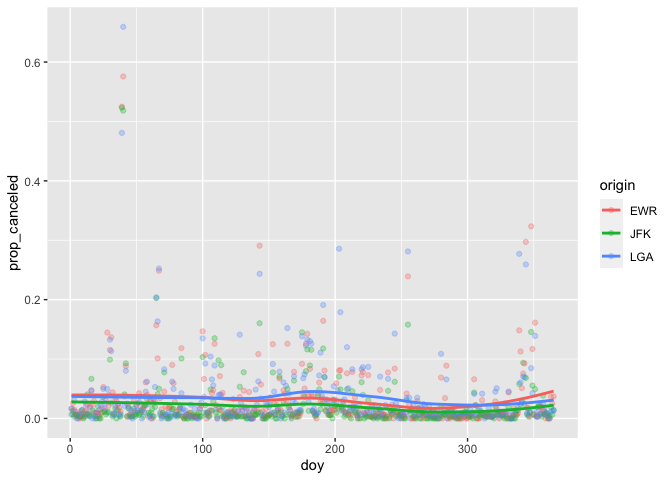

MA \[46\]15 Homework 2
================
Hongyi Yu

In this homework I’m performing a more detailed analysis of the
`nycflights13` dataset I saw in lecture. I start by loading the
packages:

``` r
library(tidyverse)
```

    ## ── Attaching packages ─────────────────────────────────────── tidyverse 1.3.2 ──
    ## ✔ ggplot2 3.4.0      ✔ purrr   1.0.1 
    ## ✔ tibble  3.1.8      ✔ dplyr   1.0.10
    ## ✔ tidyr   1.2.1      ✔ stringr 1.5.0 
    ## ✔ readr   2.1.3      ✔ forcats 0.5.2 
    ## ── Conflicts ────────────────────────────────────────── tidyverse_conflicts() ──
    ## ✖ dplyr::filter() masks stats::filter()
    ## ✖ dplyr::lag()    masks stats::lag()

``` r
library(nycflights13)
```

## Question 1

Here are the top 4 carriers in total number of flights departing NYC in
2013:

``` r
unique(flights$carrier) # all carriers
```

    ##  [1] "UA" "AA" "B6" "DL" "EV" "MQ" "US" "WN" "VX" "FL" "AS" "9E" "F9" "HA" "YV"
    ## [16] "OO"

``` r
(big_carriers <- (flights %>% group_by(carrier) %>% summarize(count = n()) %>% mutate(rank = min_rank(desc(count))) %>% arrange(rank) %>% filter(rank <= 4))$carrier)
```

    ## [1] "UA" "B6" "EV" "DL"

## Question 2

Here are the proportion of canceled flights originated at each NYC
airport for the top 4 carriers above:

``` r
flights %>% filter(carrier %in% big_carriers) %>%
  group_by(origin, carrier) %>%
  summarize(prop_canceled = mean(is.na(arr_delay) | is.na(dep_delay))) %>%
  arrange(origin, desc(prop_canceled))
```

    ## `summarise()` has grouped output by 'origin'. You can override using the
    ## `.groups` argument.

    ## # A tibble: 12 × 3
    ## # Groups:   origin [3]
    ##    origin carrier prop_canceled
    ##    <chr>  <chr>           <dbl>
    ##  1 EWR    EV            0.0542 
    ##  2 EWR    B6            0.0130 
    ##  3 EWR    UA            0.0127 
    ##  4 EWR    DL            0.0108 
    ##  5 JFK    EV            0.0582 
    ##  6 JFK    UA            0.0124 
    ##  7 JFK    B6            0.00974
    ##  8 JFK    DL            0.00686
    ##  9 LGA    EV            0.0681 
    ## 10 LGA    UA            0.0300 
    ## 11 LGA    B6            0.0152 
    ## 12 LGA    DL            0.0114

The proportions of canceling flights are mostly between 0.01 to 0.05.
The carrier EV cancels more often than other carriers. The carrier EV
originated at LGA has the highest proportion of canceling flights.

## Question 3

To investigate if there is any pattern of flight cancellations depending
on the time of year, I first create a `canceled_by_doy` dataset with the
proportion of canceled flights for each day of the year (`doy`) and
`origin`:

``` r
(canceled_by_doy <- flights %>% mutate(flights, doy = as.integer(strftime(time_hour, format = "%j"))) %>% group_by(doy, origin) %>% summarize(prop_canceled = mean(is.na(arr_delay) | is.na(dep_delay))))
```

    ## `summarise()` has grouped output by 'doy'. You can override using the `.groups`
    ## argument.

    ## # A tibble: 1,095 × 3
    ## # Groups:   doy [365]
    ##      doy origin prop_canceled
    ##    <int> <chr>          <dbl>
    ##  1     1 EWR          0.0164 
    ##  2     1 JFK          0.00673
    ##  3     1 LGA          0.0167 
    ##  4     2 EWR          0.0257 
    ##  5     2 JFK          0.0125 
    ##  6     2 LGA          0.00735
    ##  7     3 EWR          0.0149 
    ##  8     3 JFK          0.00314
    ##  9     3 LGA          0.0308 
    ## 10     4 EWR          0.00590
    ## # … with 1,085 more rows

## Question 4

``` r
canceled_by_doy %>%
  ggplot(aes(x = doy, y = prop_canceled, color = origin)) + geom_point(alpha = 0.3) +
  geom_smooth(se = FALSE)
```

    ## `geom_smooth()` using method = 'loess' and formula = 'y ~ x'

<!-- -->

Generally, the shape of curves is horizontal and smooth. The unusual
days are mid-year and end of the year, where the curve goes up slightly.
