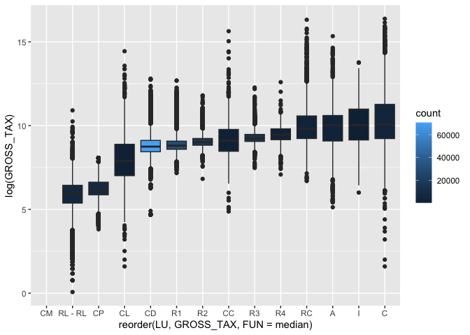

MA \[46\]15 Homework 3
================
Hongyi Yu

## Question 1

My work is to perform a preliminary EDA of the **real state properties**
in Boston in 2023. To this end, I downloaded the “Property Assessment
FY2023” data file from the [Analyze
Boston](https://data.boston.gov/dataset/property-assessment) web page,
and loaded it into a new dataset called `property`.

``` r
library(tidyverse)
```

    ## ── Attaching packages ─────────────────────────────────────── tidyverse 1.3.2 ──
    ## ✔ ggplot2 3.4.0      ✔ purrr   1.0.1 
    ## ✔ tibble  3.1.8      ✔ dplyr   1.0.10
    ## ✔ tidyr   1.2.1      ✔ stringr 1.5.0 
    ## ✔ readr   2.1.3      ✔ forcats 0.5.2 
    ## ── Conflicts ────────────────────────────────────────── tidyverse_conflicts() ──
    ## ✖ dplyr::filter() masks stats::filter()
    ## ✖ dplyr::lag()    masks stats::lag()

``` r
property <- read_csv("/Users/victoria/Desktop/MA415/hw3-yhy808/data/fy2023-property-assessment-data.csv",
                     col_types = cols_only(
                       LUC = col_integer(),
                       LU = col_character(),
                       GROSS_TAX = col_double(),
                       GROSS_AREA = col_integer()))
problems(property)
```

    ## # A tibble: 0 × 5
    ## # … with 5 variables: row <int>, col <int>, expected <chr>, actual <chr>,
    ## #   file <chr>

## Question 2

There are many “unusual” values, including tax exempt properties. Next,
I’m filtering out these cases to get a new dataset, `property_rep`.

``` r
(property_rep <- property %>% 
   group_by(LUC) %>% 
   filter(median(GROSS_TAX) < 5000000, n() >= 5, LU != "E", LU != "EA") %>%
   ungroup())
```

    ## # A tibble: 172,654 × 4
    ##      LUC LU    GROSS_AREA GROSS_TAX
    ##    <int> <chr>      <int>     <dbl>
    ##  1   105 R3          3353     8422.
    ##  2   105 R3          3299     8719.
    ##  3   105 R3          3392     8552.
    ##  4   105 R3          3108     7818.
    ##  5   104 R2          3700     8536.
    ##  6   105 R3          6278    13836.
    ##  7   105 R3          6432    13481.
    ##  8   105 R3          6048    12235.
    ##  9   105 R3          4339     9411.
    ## 10   105 R3          4659    11032.
    ## # … with 172,644 more rows

## Question 3

To summarize what I have in `property_rep`, here is a table with the
proportions of properties by land use (`LU`), ordered by proportion, and
the cumulative proportions.

``` r
(property_rep %>% group_by(LU)) %>%
  summarize(count = n()) %>%
  mutate(prop = count/sum(count)) %>%
  arrange(desc(prop)) %>%
  mutate(cul_prop = cumsum(prop))
```

    ## # A tibble: 14 × 4
    ##    LU      count    prop cul_prop
    ##    <chr>   <int>   <dbl>    <dbl>
    ##  1 CD      70572 0.409      0.409
    ##  2 R1      30442 0.176      0.585
    ##  3 R2      16903 0.0979     0.683
    ##  4 R3      13690 0.0793     0.762
    ##  5 CM      10541 0.0611     0.823
    ##  6 CP       7983 0.0462     0.870
    ##  7 RL - RL  6135 0.0355     0.905
    ##  8 C        4602 0.0267     0.932
    ##  9 A        2933 0.0170     0.949
    ## 10 RC       2930 0.0170     0.966
    ## 11 R4       2514 0.0146     0.980
    ## 12 CC       1536 0.00890    0.989
    ## 13 CL       1448 0.00839    0.998
    ## 14 I         425 0.00246    1

The “LU” with the highest count is “CD”, which means residential
condominium unit. It occupies 40.87% of the total properties.
Residential-1-family is the second high “LU” in the count of property,
which is much higher than residential-2-family and residential-3-family.
This result is expected because it is reasonable that residential units
occupy a great part of properties, and more people are willing to live
alone.

## Question 4

Finally, I summarize my findings with log gross tax boxplots for each
land use.

``` r
property_rep %>% group_by(LU) %>% 
  mutate(count = n()) %>% 
  ggplot(aes(reorder(LU, GROSS_TAX, FUN = median), log(GROSS_TAX))) + 
  geom_boxplot(aes(fill = count))
```

    ## Warning: Removed 10543 rows containing non-finite values (`stat_boxplot()`).

<!-- -->
