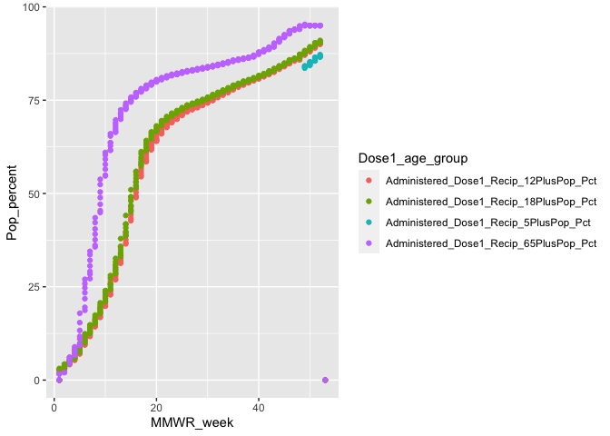
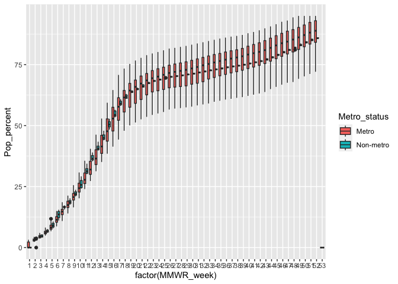

MA \[46\]15 Homework 4
================
Hongyi Yu

## Question 1

My work is to perform a preliminary analysis of COVID-19 vaccination
status in Massachusetts. I downloaded the [COVID-19
vaccination](https://data.cdc.gov/Vaccinations/COVID-19-Vaccinations-in-the-United-States-County/8xkx-amqh)
dataset from the CDC, and loaded it into a new dataset called
`covid_vac`.

``` r
library(tidyverse)
```

    ## ── Attaching packages ─────────────────────────────────────── tidyverse 1.3.2 ──
    ## ✔ ggplot2 3.4.0      ✔ purrr   1.0.1 
    ## ✔ tibble  3.1.8      ✔ dplyr   1.0.10
    ## ✔ tidyr   1.2.1      ✔ stringr 1.5.0 
    ## ✔ readr   2.1.3      ✔ forcats 0.5.2 
    ## ── Conflicts ────────────────────────────────────────── tidyverse_conflicts() ──
    ## ✖ dplyr::filter() masks stats::filter()
    ## ✖ dplyr::lag()    masks stats::lag()

``` r
covid_vac <- read_csv("data/COVID-19_Vaccinations_MA_County.csv", comment ="#")
```

    ## Rows: 8787 Columns: 80
    ## ── Column specification ────────────────────────────────────────────────────────
    ## Delimiter: ","
    ## chr  (6): Date, FIPS, Recip_County, Recip_State, SVI_CTGY, Metro_status
    ## dbl (74): MMWR_week, Completeness_pct, Administered_Dose1_Recip, Administere...
    ## 
    ## ℹ Use `spec()` to retrieve the full column specification for this data.
    ## ℹ Specify the column types or set `show_col_types = FALSE` to quiet this message.

``` r
problems(covid_vac)
```

    ## # A tibble: 0 × 5
    ## # … with 5 variables: row <int>, col <int>, expected <chr>, actual <chr>,
    ## #   file <chr>

``` r
covid_vac_s <- covid_vac %>% select(Date, Recip_County, MMWR_week, Metro_status, Administered_Dose1_Recip_5PlusPop_Pct, Administered_Dose1_Recip_12PlusPop_Pct, Administered_Dose1_Recip_18PlusPop_Pct, Administered_Dose1_Recip_65PlusPop_Pct)
(covid_vac_s <- as_tibble(covid_vac_s))
```

    ## # A tibble: 8,787 × 8
    ##    Date       Recip_County      MMWR_w…¹ Metro…² Admin…³ Admin…⁴ Admin…⁵ Admin…⁶
    ##    <chr>      <chr>                <dbl> <chr>     <dbl>   <dbl>   <dbl>   <dbl>
    ##  1 02/15/2023 Nantucket County         7 Non-me…    NA      NA      NA        NA
    ##  2 02/15/2023 Plymouth County          7 Metro      94.9    95      95        95
    ##  3 02/15/2023 Barnstable County        7 Metro      NA      NA      NA        NA
    ##  4 02/15/2023 Franklin County          7 Non-me…    95      95      95        95
    ##  5 02/15/2023 Worcester County         7 Metro      95      95      95        95
    ##  6 02/15/2023 Middlesex County         7 Metro      95      95      95        95
    ##  7 02/15/2023 Hampshire County         7 Metro      91.8    92.8    92.3      95
    ##  8 02/15/2023 Essex County             7 Metro      95      95      95        95
    ##  9 02/15/2023 Berkshire County         7 Metro      83.7    84.8    84.9      95
    ## 10 02/15/2023 Unknown County           7 <NA>       NA      NA      NA        NA
    ## # … with 8,777 more rows, and abbreviated variable names ¹​MMWR_week,
    ## #   ²​Metro_status, ³​Administered_Dose1_Recip_5PlusPop_Pct,
    ## #   ⁴​Administered_Dose1_Recip_12PlusPop_Pct,
    ## #   ⁵​Administered_Dose1_Recip_18PlusPop_Pct,
    ## #   ⁶​Administered_Dose1_Recip_65PlusPop_Pct

## Question 2

``` r
library(lubridate)
```

    ## Loading required package: timechange

    ## 
    ## Attaching package: 'lubridate'

    ## The following objects are masked from 'package:base':
    ## 
    ##     date, intersect, setdiff, union

``` r
(covid_vac_l <- covid_vac_s %>% 
    filter(as.Date(Date, format = "%m/%d/%Y") %>% year() == 2021) %>%
    pivot_longer(cols = starts_with("Administered"), names_to = "Dose1_age_group", values_to = "Pop_percent"))
```

    ## # A tibble: 21,900 × 6
    ##    Date       Recip_County     MMWR_week Metro_status Dose1_age_group    Pop_p…¹
    ##    <chr>      <chr>                <dbl> <chr>        <chr>                <dbl>
    ##  1 12/31/2021 Bristol County          52 Metro        Administered_Dose…    78.3
    ##  2 12/31/2021 Bristol County          52 Metro        Administered_Dose…    83.1
    ##  3 12/31/2021 Bristol County          52 Metro        Administered_Dose…    84.6
    ##  4 12/31/2021 Bristol County          52 Metro        Administered_Dose…    95  
    ##  5 12/31/2021 Nantucket County        52 Non-metro    Administered_Dose…    NA  
    ##  6 12/31/2021 Nantucket County        52 Non-metro    Administered_Dose…    NA  
    ##  7 12/31/2021 Nantucket County        52 Non-metro    Administered_Dose…    NA  
    ##  8 12/31/2021 Nantucket County        52 Non-metro    Administered_Dose…    NA  
    ##  9 12/31/2021 Plymouth County         52 Metro        Administered_Dose…    82.8
    ## 10 12/31/2021 Plymouth County         52 Metro        Administered_Dose…    87.2
    ## # … with 21,890 more rows, and abbreviated variable name ¹​Pop_percent

## Question 3

``` r
covid_vac_l %>% filter(Recip_County == "Suffolk County") %>%
  ggplot(aes(MMWR_week, Pop_percent)) + geom_point(aes(color = Dose1_age_group))
```

    ## Warning: Removed 341 rows containing missing values (`geom_point()`).

<!-- --> Older people have a higher
vaccination rate, while younger people have a relatively lower
vaccination rate. People in the age group of 65 plus have the highest
vaccination rate of around 95%. People in the age group of 18 plus and
12 plus have the vaccination rate of around 90%. People in the age group
of 5 plus have the lowest vaccination rate of around 87%. Also, older
people tend to get vaccinated earlier, while younger people tend to get
vaccinated later.

## Question 4

``` r
covid_vac_l %>% filter(!is.na(Metro_status), Dose1_age_group == "Administered_Dose1_Recip_18PlusPop_Pct") %>%
  ggplot(aes(factor(MMWR_week), Pop_percent, fill = Metro_status)) + geom_boxplot()
```

    ## Warning: Removed 1095 rows containing non-finite values (`stat_boxplot()`).

<!-- --> The variation of the
proportion of getting vaccination for people older than 18 is larger in
metro areas than in non-metro areas. The distributions of the MMWR_week
of getting vaccination are similar between metro areas and non-metro
areas. The average vaccination rate in metro areas is a little higher
than in non-metro areas.
