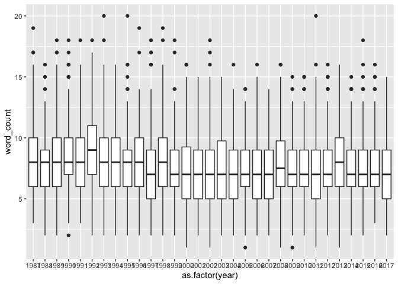
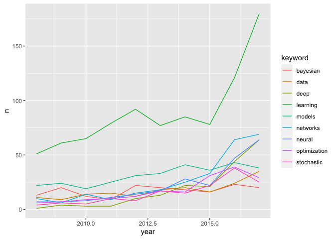
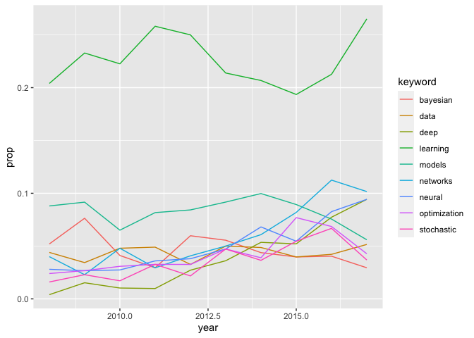

MA \[46\]15 Homework 5
================
Hongyi Yu

## Question 1

In this work I’ll analyze the titles of papers presented at the NIPS
conference from 1987 to 2017. The data in file `nips-titles.csv`, loaded
into table `papers`, contains only two columns, `year` and `title` from
the [original Kaggle
dataset](https://www.kaggle.com/benhamner/nips-papers). As an initial
check, I’m plotting the distribution of number of words in title for
each year.

``` r
library(tibble)
library(tidyr)
library(tidyverse)
```

    ## ── Attaching packages ─────────────────────────────────────── tidyverse 1.3.2 ──
    ## ✔ ggplot2 3.4.0      ✔ dplyr   1.0.10
    ## ✔ readr   2.1.3      ✔ stringr 1.5.0 
    ## ✔ purrr   1.0.1      ✔ forcats 0.5.2 
    ## ── Conflicts ────────────────────────────────────────── tidyverse_conflicts() ──
    ## ✖ dplyr::filter() masks stats::filter()
    ## ✖ dplyr::lag()    masks stats::lag()

``` r
papers <- read_csv("data/nips-titles.csv",
                   col_types = cols_only(year = col_integer(),
                                         title = col_character()))
problems(papers)
```

    ## # A tibble: 0 × 5
    ## # … with 5 variables: row <int>, col <int>, expected <chr>, actual <chr>,
    ## #   file <chr>

``` r
(papers <- papers %>% mutate(word_count = str_count(title, "\\S+")))
```

    ## # A tibble: 7,241 × 3
    ##     year title                                                           word_…¹
    ##    <int> <chr>                                                             <int>
    ##  1  1987 Self-Organization of Associative Database and Its Applications        7
    ##  2  1987 A Mean Field Theory of Layer IV of Visual Cortex and Its Appli…      17
    ##  3  1988 Storing Covariance by the Associative Long-Term Potentiation a…      15
    ##  4  1994 Bayesian Query Construction for Neural Network Models                 7
    ##  5  1994 Neural Network Ensembles, Cross Validation, and Active Learning       8
    ##  6  1994 Using a neural net to instantiate a deformable model                  9
    ##  7  1994 Plasticity-Mediated Competitive Learning                              3
    ##  8  1994 ICEG Morphology Classification using an Analogue VLSI Neural N…       9
    ##  9  1994 Real-Time Control of a Tokamak Plasma Using Neural Networks           9
    ## 10  1994 Pulsestream Synapses with Non-Volatile Analogue Amorphous-Sili…       7
    ## # … with 7,231 more rows, and abbreviated variable name ¹​word_count

``` r
ggplot(papers, aes(as.factor(year), word_count)) + geom_boxplot()
```

<!-- --> Generally, the variability of
the title sizes is stable. It slightly decreases over the years, and the
outliers also decrease a little bit.

## Question 2

``` r
keywords <- tibble(keyword = c("bayesian", "data", "deep", "models", "networks", "neural", "learning", "optimization", "stochastic"))
keyword = c("bayesian", "data", "deep", "models", "networks", "neural", "learning", "optimization", "stochastic")
papers$title <- str_to_lower(papers$title)
(papers_keyword <- papers %>%
    crossing(tibble(keyword = keyword)) %>%
    mutate(keyword_in_title = str_detect(title, keyword)) %>%
    filter(year >= 2008) %>% 
    group_by(year, keyword) %>%
    summarize(n = sum(keyword_in_title)) %>%
    spread(keyword, n))
```

    ## `summarise()` has grouped output by 'year'. You can override using the
    ## `.groups` argument.

    ## # A tibble: 10 × 10
    ## # Groups:   year [10]
    ##     year bayesian  data  deep learning models networks neural optimiza…¹ stoch…²
    ##    <int>    <int> <int> <int>    <int>  <int>    <int>  <int>      <int>   <int>
    ##  1  2008       13    11     1       51     22       10      7          6       4
    ##  2  2009       20     9     4       61     24        6      7          7       6
    ##  3  2010       12    14     3       65     19       14      8          9       5
    ##  4  2011        9    15     3       79     25        9     11         10      10
    ##  5  2012       22    12    10       92     31       15     14         12       8
    ##  6  2013       20    18    13       77     33       18     17         17      17
    ##  7  2014       18    20    22       85     41       25     28         16      15
    ##  8  2015       16    16    21       78     36       33     22         31      22
    ##  9  2016       23    24    44      121     43       64     47         39      38
    ## 10  2017       20    35    64      180     38       69     64         29      25
    ## # … with abbreviated variable names ¹​optimization, ²​stochastic

## Question 3

``` r
(papers_long <- pivot_longer(papers_keyword, cols = -year, names_to = "keyword", values_to = "n"))
```

    ## # A tibble: 90 × 3
    ## # Groups:   year [10]
    ##     year keyword          n
    ##    <int> <chr>        <int>
    ##  1  2008 bayesian        13
    ##  2  2008 data            11
    ##  3  2008 deep             1
    ##  4  2008 learning        51
    ##  5  2008 models          22
    ##  6  2008 networks        10
    ##  7  2008 neural           7
    ##  8  2008 optimization     6
    ##  9  2008 stochastic       4
    ## 10  2009 bayesian        20
    ## # … with 80 more rows

``` r
ggplot(papers_long, aes(x = year, y = n, color = keyword)) + geom_line()
```

<!-- --> “learning” is the most
popular keyword. Its popularity decreases slightly in 2013 and 2015, and
increase dramatically from 2015 to 2017. Generally, all keywords
increases in popularity for the last ten years.

## Question 4

``` r
papers_year <- papers %>%
  group_by(year) %>%
  summarize(n_papers = n())
(papers_prop <- papers_keyword %>% left_join(papers_year, by = "year") %>% 
  pivot_longer(keyword, names_to = "keyword", values_to = "n") %>%
  mutate(prop = n/n_papers))
```

    ## Warning: Using an external vector in selections was deprecated in tidyselect 1.1.0.
    ## ℹ Please use `all_of()` or `any_of()` instead.
    ##   # Was:
    ##   data %>% select(keyword)
    ## 
    ##   # Now:
    ##   data %>% select(all_of(keyword))
    ## 
    ## See <https://tidyselect.r-lib.org/reference/faq-external-vector.html>.

    ## # A tibble: 90 × 5
    ## # Groups:   year [10]
    ##     year n_papers keyword          n   prop
    ##    <int>    <int> <chr>        <int>  <dbl>
    ##  1  2008      250 bayesian        13 0.052 
    ##  2  2008      250 data            11 0.044 
    ##  3  2008      250 deep             1 0.004 
    ##  4  2008      250 models          22 0.088 
    ##  5  2008      250 networks        10 0.04  
    ##  6  2008      250 neural           7 0.028 
    ##  7  2008      250 learning        51 0.204 
    ##  8  2008      250 optimization     6 0.024 
    ##  9  2008      250 stochastic       4 0.016 
    ## 10  2009      262 bayesian        20 0.0763
    ## # … with 80 more rows

``` r
ggplot(papers_prop, aes(x = year, y = prop, color = keyword)) + geom_line()
```

<!-- --> “learning” is the keyword
with the highest proportion in titles, which is the same as Question 3.
However, the proportion of “learning” decreases from 2011 to 2015, which
is different from Question 3. Then, it increases dramatically from 2015
to 2017 as we see in Question 3. Generally, most keywords have a rising
trend with the proportion of titles, except “models” and “data”.
