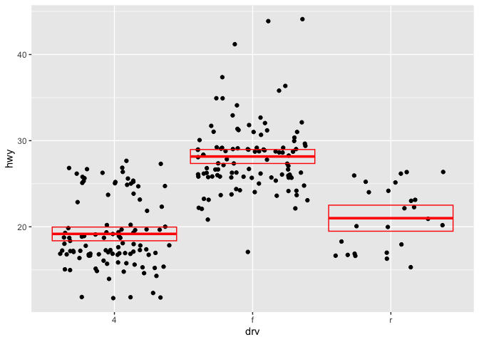
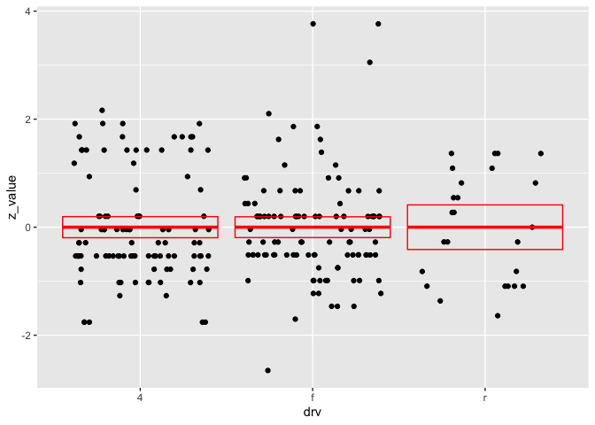

MA \[46\]15 Homework 6
================
Hongyi Yu

## Question 1

``` r
library(tidyverse)
```

    ## ── Attaching packages ─────────────────────────────────────── tidyverse 1.3.2 ──
    ## ✔ ggplot2 3.4.0      ✔ purrr   1.0.1 
    ## ✔ tibble  3.1.8      ✔ dplyr   1.0.10
    ## ✔ tidyr   1.2.1      ✔ stringr 1.5.0 
    ## ✔ readr   2.1.3      ✔ forcats 0.5.2 
    ## ── Conflicts ────────────────────────────────────────── tidyverse_conflicts() ──
    ## ✖ dplyr::filter() masks stats::filter()
    ## ✖ dplyr::lag()    masks stats::lag()

``` r
t_alpha_2 <- function(df = Inf, alpha) {
  Q <- qt(alpha/2, df)
  return (Q)
}
```

df means the degrees of freedom. When df = Inf, the degree of freedom
approaches infinity and the distribution of T becomes a standard normal
distribution with mean 0 and standard deviation 1.

## Question 2

``` r
t_data <- function(x, alpha=0.05) {
  n <- length(x)
  t_val <- t_alpha_2(n-1, alpha)
  mx <- mean(x)
  sx <- sd(x)
  lower <- mx - t_val*sx/sqrt(n)
  upper <- mx + t_val*sx/sqrt(n)
  tibble(y = mx, ymin = lower, ymax = upper)
}

ggplot(data = mpg, aes(x = drv, y = hwy)) + 
  geom_point(position = "jitter") +
  stat_summary(fun.data = t_data, geom = "crossbar", color = "red")
```

<!-- -->

## Question 3

``` r
z_score <- function(x, mu = NA, sigma = NA){
  if (is.na(mu)) {
    mu <- mean(x)
  }
  if (is.na(sigma)) {
    sigma <- sd(x)
  }
  (x - mu)/sigma
}

mpg %>% group_by(drv) %>% 
  mutate(z_value = z_score(hwy)) %>% 
  ggplot(aes(x = drv, y = z_value)) +
  geom_point(position = "jitter") +
  stat_summary(fun.data = function(x) t_data(x, 0.05), geom = "crossbar", color = "red")
```

<!-- -->
