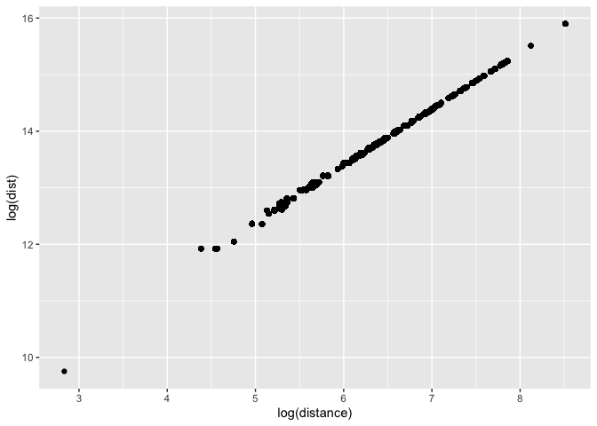
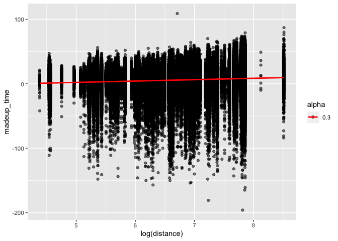
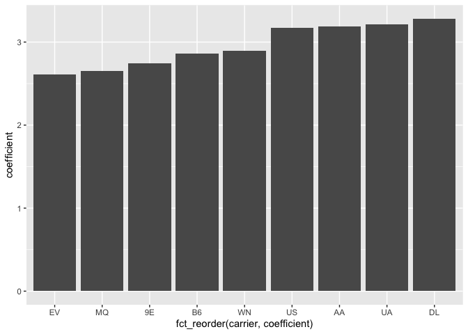

MA \[46\]15 Homework 7
================
Hongyi Yu

## Question 1

``` r
library(tidyverse)
```

    ## ── Attaching packages ─────────────────────────────────────── tidyverse 1.3.2 ──
    ## ✔ ggplot2 3.4.0      ✔ purrr   1.0.1 
    ## ✔ tibble  3.1.8      ✔ dplyr   1.0.10
    ## ✔ tidyr   1.2.1      ✔ stringr 1.5.0 
    ## ✔ readr   2.1.3      ✔ forcats 0.5.2 
    ## ── Conflicts ────────────────────────────────────────── tidyverse_conflicts() ──
    ## ✖ dplyr::filter() masks stats::filter()
    ## ✖ dplyr::lag()    masks stats::lag()

``` r
library(nycflights13)
library(geosphere)

dist_geo <- function (lon_from, lat_from, lon_to, lat_to) {
  geosphere::distGeo(cbind(lon_from, lat_from), c(lon_to, lat_to))
}

jfk <- airports %>% 
  filter(faa == "JFK") %>% 
  select(lon = lon, lat = lat)

(flights_dist <- airports %>% 
  filter(faa %in% unique(flights$dest)) %>%
  mutate(dist=dist_geo(lon, lat, jfk$lon, jfk$lat)) %>% 
  inner_join(flights, by = c("faa" = "dest")))
```

    ## # A tibble: 329,174 × 27
    ##    faa   name         lat   lon   alt    tz dst   tzone   dist  year month   day
    ##    <chr> <chr>      <dbl> <dbl> <dbl> <dbl> <chr> <chr>  <dbl> <int> <int> <int>
    ##  1 ABQ   Albuquerq…  35.0 -107.  5355    -7 A     Amer… 2.94e6  2013    10     1
    ##  2 ABQ   Albuquerq…  35.0 -107.  5355    -7 A     Amer… 2.94e6  2013    10     2
    ##  3 ABQ   Albuquerq…  35.0 -107.  5355    -7 A     Amer… 2.94e6  2013    10     3
    ##  4 ABQ   Albuquerq…  35.0 -107.  5355    -7 A     Amer… 2.94e6  2013    10     4
    ##  5 ABQ   Albuquerq…  35.0 -107.  5355    -7 A     Amer… 2.94e6  2013    10     5
    ##  6 ABQ   Albuquerq…  35.0 -107.  5355    -7 A     Amer… 2.94e6  2013    10     6
    ##  7 ABQ   Albuquerq…  35.0 -107.  5355    -7 A     Amer… 2.94e6  2013    10     7
    ##  8 ABQ   Albuquerq…  35.0 -107.  5355    -7 A     Amer… 2.94e6  2013    10     8
    ##  9 ABQ   Albuquerq…  35.0 -107.  5355    -7 A     Amer… 2.94e6  2013    10     9
    ## 10 ABQ   Albuquerq…  35.0 -107.  5355    -7 A     Amer… 2.94e6  2013    10    10
    ## # … with 329,164 more rows, and 15 more variables: dep_time <int>,
    ## #   sched_dep_time <int>, dep_delay <dbl>, arr_time <int>,
    ## #   sched_arr_time <int>, arr_delay <dbl>, carrier <chr>, flight <int>,
    ## #   tailnum <chr>, origin <chr>, air_time <dbl>, distance <dbl>, hour <dbl>,
    ## #   minute <dbl>, time_hour <dttm>

``` r
ggplot(flights_dist, aes(x = log(distance), y = log(dist))) + geom_point()
```

<!-- -->

## Question 2

``` r
flights_mt <- flights_dist %>%
  filter(!is.na(dep_delay) & !is.na(arr_delay) & !is.na(distance) & !is.na(tailnum)) %>%
  mutate(madeup_time = dep_delay - arr_delay)

lm_madeup_time <- lm(madeup_time ~ log(dist), flights_mt)

ggplot(flights_mt, aes(x = log(distance), y = madeup_time, alpha = 0.3)) + 
  geom_point() +
  geom_smooth(method = "lm", color = "red", se = FALSE)
```

    ## `geom_smooth()` using formula = 'y ~ x'

<!-- -->

``` r
lm(madeup_time ~ log(dist), flights_mt)
```

    ## 
    ## Call:
    ## lm(formula = madeup_time ~ log(dist), data = flights_mt)
    ## 
    ## Coefficients:
    ## (Intercept)    log(dist)  
    ##     -24.355        2.132

``` r
lax <- airports %>% filter(faa == "LAX") %>% select(lon, lat)
log_dist_lax <- log(dist_geo(jfk$lon, jfk$lat, lax$lon, lax$lat)) 
madeup_time_lax <- coef(lm_madeup_time)[1] + coef(lm_madeup_time)[2] * log_dist_lax
(arr_delay_lax <- 30 - madeup_time_lax)
```

    ## (Intercept) 
    ##    21.94689

The linear coefficient is 2.132, which verifies the assumption that the
travel will have more made-up time for delay if it has a long distance.
If you’re traveling to Los Angeles international airport and your flight
left JFK with a 30 minute delay, the predicted arrival delay is about 22
minutes.

## Question 3

``` r
flights_load <- flights %>%
  group_by(origin, month, day) %>% 
  summarize(trips = n())
```

    ## `summarise()` has grouped output by 'origin', 'month'. You can override using
    ## the `.groups` argument.

``` r
rep_flights <- flights %>%
  group_by(carrier) %>% filter(n_distinct(flight) > 100) %>%
  group_by(carrier, flight) %>% filter(n() > 50) %>% ungroup()

(flights_load <- left_join(rep_flights, flights_load, by = c("origin", "month", "day")) %>%
  mutate(ontime = if_else(arr_delay <= 15 & !is.na(dep_time), 1, 0)))
```

    ## # A tibble: 271,632 × 21
    ##     year month   day dep_time sched_de…¹ dep_d…² arr_t…³ sched…⁴ arr_d…⁵ carrier
    ##    <int> <int> <int>    <int>      <int>   <dbl>   <int>   <int>   <dbl> <chr>  
    ##  1  2013     1     1      517        515       2     830     819      11 UA     
    ##  2  2013     1     1      533        529       4     850     830      20 UA     
    ##  3  2013     1     1      542        540       2     923     850      33 AA     
    ##  4  2013     1     1      544        545      -1    1004    1022     -18 B6     
    ##  5  2013     1     1      554        600      -6     812     837     -25 DL     
    ##  6  2013     1     1      555        600      -5     913     854      19 B6     
    ##  7  2013     1     1      557        600      -3     838     846      -8 B6     
    ##  8  2013     1     1      558        600      -2     753     745       8 AA     
    ##  9  2013     1     1      558        600      -2     849     851      -2 B6     
    ## 10  2013     1     1      558        600      -2     853     856      -3 B6     
    ## # … with 271,622 more rows, 11 more variables: flight <int>, tailnum <chr>,
    ## #   origin <chr>, dest <chr>, air_time <dbl>, distance <dbl>, hour <dbl>,
    ## #   minute <dbl>, time_hour <dttm>, trips <int>, ontime <dbl>, and abbreviated
    ## #   variable names ¹​sched_dep_time, ²​dep_delay, ³​arr_time, ⁴​sched_arr_time,
    ## #   ⁵​arr_delay

## Question 4

``` r
model <- glm(ontime ~ trips + carrier-1, flights_load, family = binomial)
(coef<-coef(model))
```

    ##        trips    carrier9E    carrierAA    carrierB6    carrierDL    carrierEV 
    ## -0.006013026  2.743465696  3.191698237  2.857804078  3.281431814  2.610325727 
    ##    carrierMQ    carrierUA    carrierUS    carrierWN 
    ##  2.649562646  3.212374426  3.172305391  2.894372086

``` r
coef_carriers<-coef(model)[2:length(coef(model))]
carrier_data <- data.frame(
  carrier = c("9E","AA", "B6", "DL", "EV", "MQ", "UA", "US", "WN"),
  coefficient = coef_carriers)
ggplot(carrier_data, aes(x=fct_reorder(carrier, coefficient), y=coefficient)) +
  geom_bar(stat='identity')
```

<!-- -->

``` r
((log(1)-coef[5])/coef[1])
```

    ## carrierDL 
    ##  545.7206

The coefficient of trip is -0.006, which is negative. It means that an
increase in the number of trips in a given date will decrease the
probability that the flight being on-time, which meets my expectation.
We need around 546 trips for the predicted probability of the flight
being on-time to be 50%.
