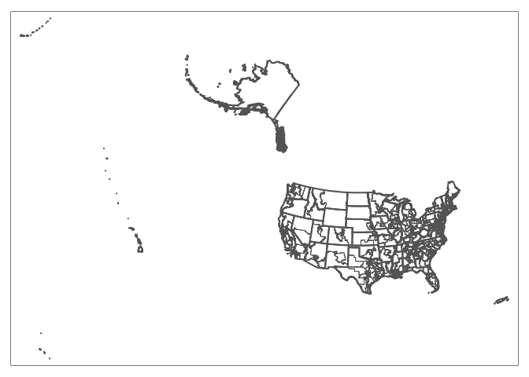
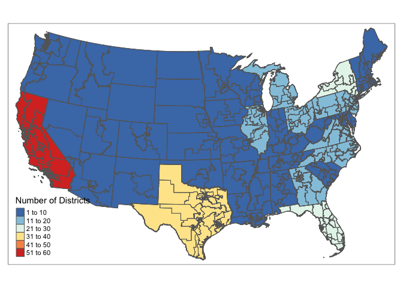
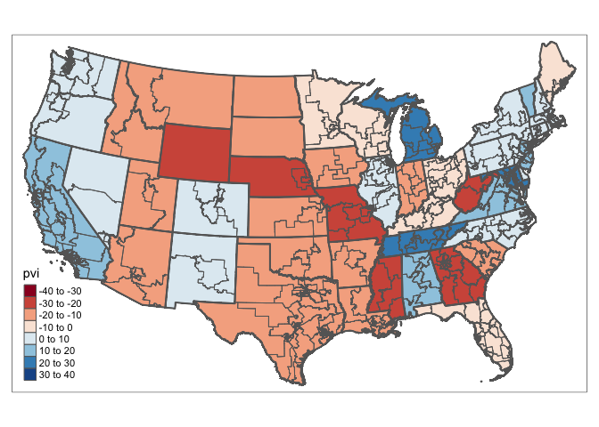

MA \[46\]15 Homework 8
================
Hongyi Yu

## Question 1

``` r
library(tidyverse)
```

    ## ── Attaching packages ─────────────────────────────────────── tidyverse 1.3.2 ──
    ## ✔ ggplot2 3.4.0      ✔ purrr   1.0.1 
    ## ✔ tibble  3.1.8      ✔ dplyr   1.0.10
    ## ✔ tidyr   1.2.1      ✔ stringr 1.5.0 
    ## ✔ readr   2.1.3      ✔ forcats 0.5.2 
    ## ── Conflicts ────────────────────────────────────────── tidyverse_conflicts() ──
    ## ✖ dplyr::filter() masks stats::filter()
    ## ✖ dplyr::lag()    masks stats::lag()

``` r
library(sf)
```

    ## Linking to GEOS 3.11.0, GDAL 3.5.3, PROJ 9.1.0; sf_use_s2() is TRUE

``` r
library(tmap)

us_states <- st_read("cb_2022_us_state_500k/cb_2022_us_state_500k.shp", quiet = TRUE)
us_dist <- st_read("cb_2022_us_cd118_500k/cb_2022_us_cd118_500k.shp", quiet = TRUE)

epsg <- 2163
us_states <- us_states %>% st_transform(epsg)
us_dist <- us_dist %>% st_transform(epsg)

tm_shape(us_states) + tm_borders(lwd = 2) + tm_shape(us_dist) + tm_borders()
```

<!-- -->

## Question 2

``` r
us_cont <- us_states %>%
  filter(!(STUSPS %in% c("HI","AK", "PR","VI", "GU", "AS", "MP"))) %>%
  select(STATEFP, STUSPS) %>%
  st_transform(epsg)

us_cont$STUSPS <- as.factor(us_cont$STUSPS)
us_cont$STUSPS <- droplevels(us_cont$STUSPS)

us_dist$CD118FP <- as.factor(us_dist$CD118FP)
us_dist$CD118FP <- droplevels(us_dist$CD118FP)

us_dist_cont <- st_join(us_cont, us_dist) %>%
  filter(STATEFP.x == STATEFP.y) %>%
  select(STUSPS, CD118FP)

us_dist_cont_num <- us_dist_cont %>% 
  group_by(STUSPS) %>% 
  summarise(num = n())
  

tm_shape(us_dist_cont_num) +
  tm_polygons(col = "num", palette = "-RdYlBu",, title = "Number of Districts") +
  tm_shape(us_dist) +
  tm_borders()
```

<!-- -->

## Question 3

``` r
district_pvi <- read.csv("data/cook-pvi-2023.csv")

convert_pvi <- function(PVI) {
  if(PVI == "EVEN") {
    return(0)
  } else {
    P <- substr(PVI, 1, 1)
    S <- as.numeric(substr(PVI, 3, 4))
    if(P == "R") {
      return(-S)
    } else {
      return(S)
    }
  }
}

convert_district <- function(District) {
  if(substr(District, nchar(District)-1, nchar(District)) == "AL") {
    return("00")
  } else if(substr(District,nchar(District)-1, nchar(District)-1) == "-") {
    return(paste0("0", substr(District,nchar(District), nchar(District))))
  } else {
    return(substr(District, nchar(District)-1, nchar(District)))
  }
}

district_pvi <- district_pvi %>%
  mutate(state = substr(District, 1, 2)) %>%
  mutate(district = sapply(district_pvi$District, convert_district)) %>%
  mutate(pvi = sapply(district_pvi$PVI, convert_pvi)) %>%
  select(state, district, pvi)
```

## Question 4

``` r
us_dist_cont_pvi <- us_dist_cont %>%
  inner_join(district_pvi, by = c("STUSPS" = "state"))

tm_shape(us_dist_cont_pvi) +
  tm_polygons("pvi", palette = "RdBu", n = 9) +
  tm_shape(us_cont) +
  tm_borders(lwd = 2) +
  tm_shape(us_dist) +
  tm_borders()
```

    ## Variable(s) "pvi" contains positive and negative values, so midpoint is set to 0. Set midpoint = NA to show the full spectrum of the color palette.

<!-- -->
