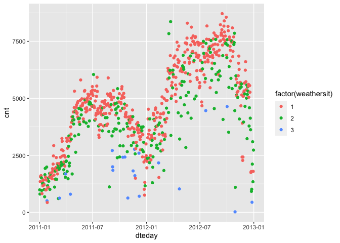
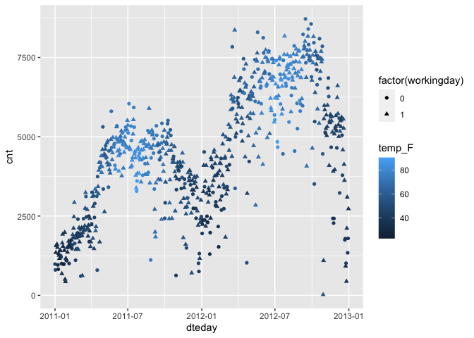

MA \[46\]15: Lab Activity 3
================
Hongyi Yu

# Introduction

Bike sharing systems are new generation of traditional bike rentals
where whole process from membership, rental and return back has become
automatic. Through these systems, user is able to easily rent a bike
from a particular position and return back at another position.
Currently, there are about over 500 bike-sharing programs around the
world which is composed of over 500 thousands bicycles. Today, there
exists great interest in these systems due to their important role in
traffic, environmental and health issues.

We analyze the bike sharing dataset provided by Capital Bikeshare and
available as a [UCI ML
repository](http://archive.ics.uci.edu/ml/datasets/Bike+Sharing+Dataset).
The data span bike sharing activity in the Washington DC metro area for
two years, 2011 and 2012. We start by loading the data:

``` r
library(tidyverse)
bike <- read_csv("/Users/victoria/Desktop/MA415/lab3-yhy808/data/bike-sharing.csv")
```

The variable `dteday` means date. The variable `holiday` means whether
day is holiday or not. The variable `workingday` means if day is neither
weekend nor holiday is 1, otherwise is 0. The variable `weathersit`
means - 1: Clear, Few clouds, Partly cloudy, Partly cloudy - 2: Mist +
Cloudy, Mist + Broken clouds, Mist + Few clouds, Mist - 3: Light Snow,
Light Rain + Thunderstorm + Scattered clouds, Light Rain + Scattered
clouds - 4: Heavy Rain + Ice Pallets + Thunderstorm + Mist, Snow + Fog
The variable `temp` means Normalized temperature in Celsius. The values
are derived via (t-t_min)/(t_max-t_min), t_min=-8, t_max=+39.

# Data analysis

``` r
(bike_fahr <- bike %>% mutate(instant, temp_F = 1.8*(temp*47-8)+32))
```

    ## # A tibble: 731 × 17
    ##    instant dteday     season    yr  mnth holiday weekday working…¹ weath…²  temp
    ##      <dbl> <date>      <dbl> <dbl> <dbl>   <dbl>   <dbl>     <dbl>   <dbl> <dbl>
    ##  1       1 2011-01-01      1     0     1       0       6         0       2 0.344
    ##  2       2 2011-01-02      1     0     1       0       0         0       2 0.363
    ##  3       3 2011-01-03      1     0     1       0       1         1       1 0.196
    ##  4       4 2011-01-04      1     0     1       0       2         1       1 0.2  
    ##  5       5 2011-01-05      1     0     1       0       3         1       1 0.227
    ##  6       6 2011-01-06      1     0     1       0       4         1       1 0.204
    ##  7       7 2011-01-07      1     0     1       0       5         1       2 0.197
    ##  8       8 2011-01-08      1     0     1       0       6         0       2 0.165
    ##  9       9 2011-01-09      1     0     1       0       0         0       1 0.138
    ## 10      10 2011-01-10      1     0     1       0       1         1       1 0.151
    ## # … with 721 more rows, 7 more variables: atemp <dbl>, hum <dbl>,
    ## #   windspeed <dbl>, casual <dbl>, registered <dbl>, cnt <dbl>, temp_F <dbl>,
    ## #   and abbreviated variable names ¹​workingday, ²​weathersit

``` r
sum(bike_fahr$cnt) == sum(bike_fahr$casual) + sum(bike_fahr$registered)
```

    ## [1] TRUE

Since we get “TRUE”, we have checked that the total number of bike
rentals corresponds to the number of casual and registered rentals.

``` r
bike %>% ggplot() + geom_point(aes(x= dteday, y = cnt, color = factor(weathersit)))
```

<!-- -->

The number of bike rentals is lowest during the January in each year. It
will increase from January to June each year and become the highest in
the July. Then, the number of bike rentals will decrease from July to
December each year. Generally, the number of bike rentals growths from
2011 to 2012. Also, when weather condition is good, which means the
weather is clear and has few clouds, there will be more bike rentals.
When weather condition is bad, which means rain and snow, the number of
bike rentals will be small.

# Discussion

``` r
bike_fahr %>% ggplot() + geom_point(aes(x= dteday, y = cnt, color = temp_F, shape = factor(workingday)))
```

<!-- --> The number of bike
rentals increases when the temperature is warm, and the number of bike
rentals decreases when the temperature is cold. There is no obvious
pattern between the number of bike rentals and if the date is a holiday
or weekend.
