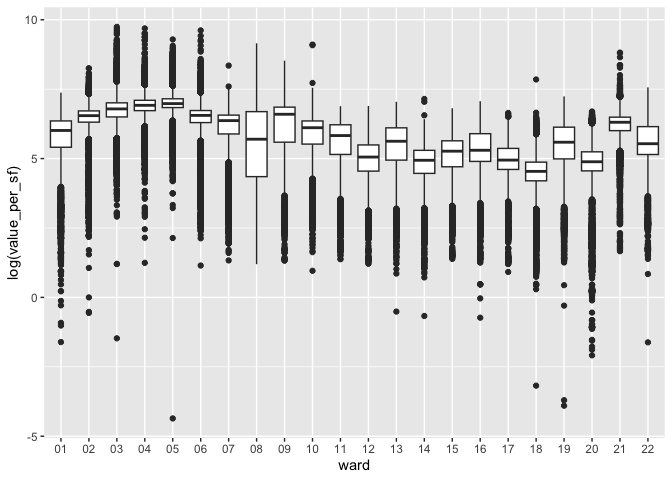

MA \[46\]15 Lab activity 4
================
Hongyi Yu

# Introduction

My work in this lab activity is to continue the analysis of the **real
state properties** in Boston in 2023. In Homework 3 I created a dataset
called `property`, based on data the “Property Assessment FY2023” data
file from the [Analyze
Boston](https://data.boston.gov/dataset/property-assessment) web page.

``` r
library(tidyverse)
```

    ## ── Attaching packages ─────────────────────────────────────── tidyverse 1.3.2 ──
    ## ✔ ggplot2 3.4.0      ✔ purrr   1.0.1 
    ## ✔ tibble  3.1.8      ✔ dplyr   1.0.10
    ## ✔ tidyr   1.2.1      ✔ stringr 1.5.0 
    ## ✔ readr   2.1.3      ✔ forcats 0.5.2 
    ## ── Conflicts ────────────────────────────────────────── tidyverse_conflicts() ──
    ## ✖ dplyr::filter() masks stats::filter()
    ## ✖ dplyr::lag()    masks stats::lag()

``` r
property <- read_csv("/Users/victoria/Desktop/MA415/lab4-yhy808/Data/fy2023-property-assessment-data.csv",
                     col_types = cols_only(PID = col_character(),
                                           TOTAL_VALUE = col_double(),
                                           LAND_SF = col_double()))
problems(property)
```

    ## # A tibble: 0 × 5
    ## # … with 5 variables: row <int>, col <int>, expected <chr>, actual <chr>,
    ## #   file <chr>

``` r
property <- property %>% filter(!is.na(TOTAL_VALUE), !is.na(LAND_SF), TOTAL_VALUE > 0, LAND_SF > 0)
```

# Data analysis

``` r
(property <- property %>% mutate(ward = substring(PID,1,2), value_per_sf = TOTAL_VALUE/LAND_SF))
```

    ## # A tibble: 162,536 × 5
    ##    PID        LAND_SF TOTAL_VALUE ward  value_per_sf
    ##    <chr>        <dbl>       <dbl> <chr>        <dbl>
    ##  1 0100001000    1150      784200 01            682.
    ##  2 0100002000    1150      811800 01            706.
    ##  3 0100003000    1150      796300 01            692.
    ##  4 0100004000    1150      727900 01            633.
    ##  5 0100005000    2010      794800 01            395.
    ##  6 0100006000    2500     1288300 01            515.
    ##  7 0100007000    2500     1255200 01            502.
    ##  8 0100008000    2500     1139200 01            456.
    ##  9 0100009000    2500      876300 01            351.
    ## 10 0100010000    2500     1027200 01            411.
    ## # … with 162,526 more rows

``` r
property %>% ggplot(aes(ward, log(value_per_sf))) + geom_boxplot()
```

<!-- -->

# Discussion

``` r
(property <- property %>% mutate(equiv_sm = 1000000/value_per_sf*0.093) %>%
  group_by(ward) %>%
  summarize(mean_equiv = mean(equiv_sm)) %>%
  mutate(rank = min_rank(mean_equiv)) %>%
  arrange(rank))
```

    ## # A tibble: 22 × 3
    ##    ward  mean_equiv  rank
    ##    <chr>      <dbl> <int>
    ##  1 04          133.     1
    ##  2 03          175.     2
    ##  3 21          277.     3
    ##  4 06          296.     4
    ##  5 02          447.     5
    ##  6 07          500.     6
    ##  7 10          594.     7
    ##  8 05          653.     8
    ##  9 22          775.     9
    ## 10 09          825.    10
    ## # … with 12 more rows

Ward 04 has the most expensive properties on average, where 1 million
dollars is equivalent to the area of 132.73 square meters. It is cheaper
than other prime property square meterages around the world, such as
Monaco, Hongkong, London, New York, and Singapore. The property square
meterage is similar with Dubai. And it is more expensive than Cape Town
and Sao Paulo.
