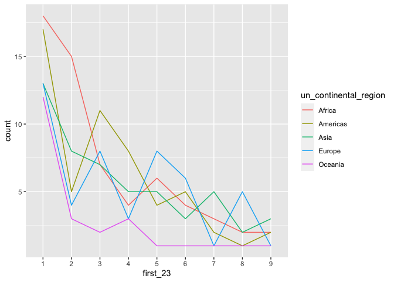

MA \[46\]15: Lab Activity 5
================
Group: tidyverse

**`[==[`** In this lab activity you’ll be working as a group. The data
to be analyzed is `data/world_pop.csv`, and contains information on
world’s population by country. Your task is to verify [Benford’s
law](https://en.wikipedia.org/wiki/Benford%27s_law), an empirical law
saying that the frequency of occurrence of first digits has a specific
pattern, using this dataset. To this end:

1.  In a **Introduction** section, put a simple description of the
    dataset (read the comment line in the CSV file for a reference) and
    about Benford’s law. Load the CSV into a table called `world_pop`.
2.  In a **Data Analysis** section, compute for each
    `un_continental_region`, the proportion of times `1` was a first
    digit among all countries in 2017, the proportion of times `2` was a
    first digit, and so on. Store your results in a table called
    `world_prop`. Using `world_prop`, make a line plot of the
    frequencies (y-axis) per digit (x-axis), coloring the lines by
    `un_continental_region`.
3.  Compute the expected frequencies according to Benford’s law and
    compare them to the frequencies you obtained in the data analysis.
    Write a short paragraph about your conclusions in a **Discussion**
    section. The main goal here is **to work as a group**. There will be
    a single repository for the whole group, so in the end you have to
    push a single report. I strongly recommend that you elect a project
    manager that will merge conflicts when group members push
    conflicting commits. Don’t forget to use **branches**! **`]==]`**

# Introduction

This is a list of countries and other inhabited territories of the world
by total population, based on estimates published by the United Nations
in the 2022 revision of World Population Prospects. Benford’s law states
that in many real-life sets of numerical data, the leading digit is
likely to be small.Benford’s law also makes predictions about the
distribution of second digits, third digits, digit combinations, and so
on. We will verify Benford’s law using the dataset.

``` r
library(tidyverse)
```

    ## ── Attaching packages ─────────────────────────────────────── tidyverse 1.3.2 ──
    ## ✔ ggplot2 3.4.0      ✔ purrr   1.0.1 
    ## ✔ tibble  3.1.8      ✔ dplyr   1.0.10
    ## ✔ tidyr   1.2.1      ✔ stringr 1.5.0 
    ## ✔ readr   2.1.3      ✔ forcats 0.5.2 
    ## ── Conflicts ────────────────────────────────────────── tidyverse_conflicts() ──
    ## ✖ dplyr::filter() masks stats::filter()
    ## ✖ dplyr::lag()    masks stats::lag()

``` r
world_pop <- read.csv("data/world_pop.csv", skip=1, header=TRUE)
```

# Data Analysis

``` r
(world_prop <- world_pop %>%
  mutate(char_22 = as.character(population_2022), char_23 = as.character(population_2023), 
         first_23 = substr(population_2023, 1, 1)) %>% 
  group_by(un_continental_region, first_23) %>% 
  summarize(count = n()) %>% 
  mutate(prop = count / sum(count)))
```

    ## `summarise()` has grouped output by 'un_continental_region'. You can override
    ## using the `.groups` argument.

    ## # A tibble: 42 × 4
    ## # Groups:   un_continental_region [5]
    ##    un_continental_region first_23 count   prop
    ##    <chr>                 <chr>    <int>  <dbl>
    ##  1 Africa                1           18 0.310 
    ##  2 Africa                2           15 0.259 
    ##  3 Africa                3            7 0.121 
    ##  4 Africa                4            4 0.0690
    ##  5 Africa                5            6 0.103 
    ##  6 Africa                6            4 0.0690
    ##  7 Africa                8            2 0.0345
    ##  8 Africa                9            2 0.0345
    ##  9 Americas              1           17 0.309 
    ## 10 Americas              2            5 0.0909
    ## # … with 32 more rows

``` r
world_prop %>% 
  ggplot(aes(first_23, count, group=un_continental_region)) + geom_line(aes(color = un_continental_region))
```

<!-- -->

# Discussion

``` r
benford <- tribble(~d, ~P_d,
                   #--#-----#
                   1, 0.301,
                   2, 0.176,
                   3, 0.125,
                   4, 0.097,
                   5, 0.079,
                   6, 0.067,
                   7, 0.058,
                   8, 0.051,
                   9, 0.046)
```

``` r
(e_counts <- world_prop %>% 
   mutate(region_total = sum(count)) %>% 
   ungroup() %>% 
   add_row(un_continental_region = "Africa", first_23 = "7", count = 0, prop = 0.0, region_total = 58) %>% 
   add_row(un_continental_region = "Oceania", first_23 = "6", count = 0, prop = 0.0, region_total = 23) %>% 
   add_row(un_continental_region = "Oceania", first_23 = "8", count = 0, prop = 0.0, region_total = 23) %>% 
   mutate(E_count = region_total * benford$P_d[as.numeric(first_23)]) %>% 
   arrange(un_continental_region, first_23))
```

    ## # A tibble: 45 × 6
    ##    un_continental_region first_23 count   prop region_total E_count
    ##    <chr>                 <chr>    <dbl>  <dbl>        <dbl>   <dbl>
    ##  1 Africa                1           18 0.310            58   17.5 
    ##  2 Africa                2           15 0.259            58   10.2 
    ##  3 Africa                3            7 0.121            58    7.25
    ##  4 Africa                4            4 0.0690           58    5.63
    ##  5 Africa                5            6 0.103            58    4.58
    ##  6 Africa                6            4 0.0690           58    3.89
    ##  7 Africa                7            0 0                58    3.36
    ##  8 Africa                8            2 0.0345           58    2.96
    ##  9 Africa                9            2 0.0345           58    2.67
    ## 10 Americas              1           17 0.309            55   16.6 
    ## # … with 35 more rows

``` r
(dists <- e_counts %>% 
  mutate(dist_i = (count - E_count)^2) %>% 
  group_by(un_continental_region) %>% 
  summarize(euclid_dist = sqrt(sum(dist_i))) %>% 
  arrange(euclid_dist))
```

    ## # A tibble: 5 × 2
    ##   un_continental_region euclid_dist
    ##   <chr>                       <dbl>
    ## 1 Asia                         3.60
    ## 2 Oceania                      5.72
    ## 3 Africa                       6.38
    ## 4 Americas                     7.28
    ## 5 Europe                       8.17
